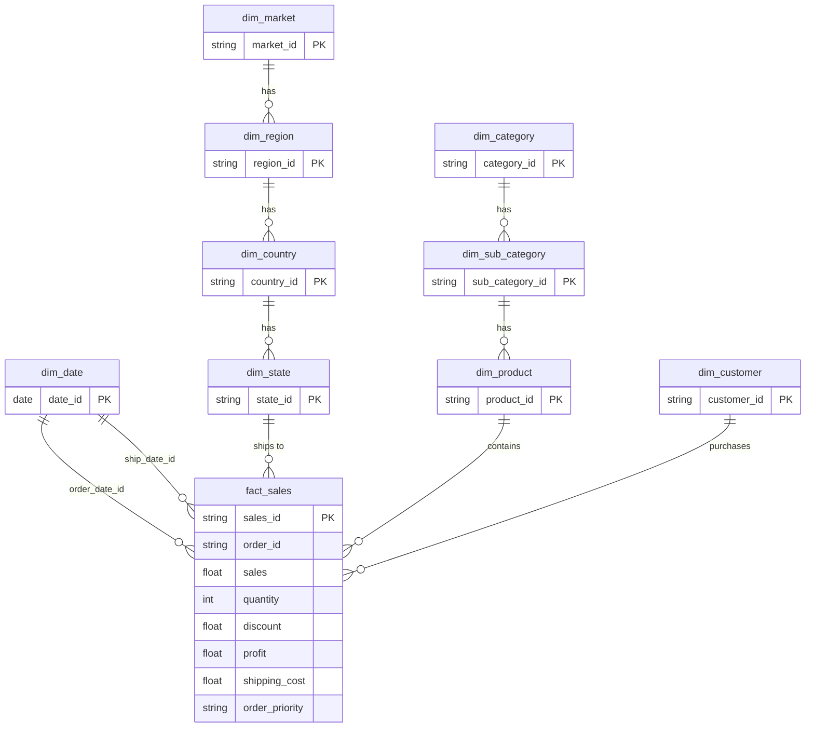

[](README.zh-TW.md)
&nbsp;&nbsp;
[](README.zh-CN.md)


# Superstore Sales & Profit Analysis

**MySQL · Python · Power BI · Data Warehouse**

---

## Project Overview

This project analyzes the [Kaggle Superstore Sales Dataset](https://www.kaggle.com/datasets/laibaanwer/superstore-sales-dataset) to uncover product performance, profitability drivers, and the impact of discount strategies across 7 global markets (2011–2014).

The goal is to support **procurement, inventory planning, and promotion optimization** through structured data modeling and visual analytics.

### What This Project Covers

- Data cleaning and validation using **Python (pandas)**
- Snowflake-style dimensional modeling in **MySQL** (staging → dimensions/facts → views):  
  `vw_sales_full` for row-level SQL/Python analysis; `vw_sales_summary` for pre-aggregated KPI queries
- Bidirectional data reconciliation for pipeline integrity verification
- 3-page interactive dashboard in **Power BI**
- Business insights and actionable recommendations

---

## Dataset

| Item | Detail |
|---|---|
| Source | [Kaggle — Superstore Sales Dataset](https://www.kaggle.com/datasets/laibaanwer/superstore-sales-dataset) by Laiba Anwer |
| Rows | ~51,000+ |
| Time Range | 2011–2014 |
| Coverage | 7 global markets (APAC, EU, US, LATAM, EMEA, Africa, Canada) |
| Key Fields | Order Date, Ship Date, Customer, Segment, Region, Category, Sub-Category, Sales, Quantity, Discount, Profit, Shipping Cost, Order Priority |

---

## Tools & Technologies

| Tool | Purpose |
|---|---|
| Python (pandas) | Data cleaning, validation, audit reporting |
| MySQL | Dimensional modeling, data loading, analytical SQL |
| Power BI | Interactive dashboard and KPI visualization |
| GitHub | Version control and documentation |

---

## 1. Data Cleaning (Python)

### `01_raw_data_preview_cnt.py` — Raw Data Audit
- Generates a full audit report (Excel): descriptive statistics, missing values, unique counts, data types
- Exports row preview (100 rows) and random sample (100 rows) as CSV

### `02_clean_data_cnt.py` — Data Cleaning & Validation
- **Date formatting**: Converts inconsistent formats (DD/MM/YYYY, DD-MM-YYYY) to standard datetime
- **Numeric validation**: Strips currency symbols/commas, coerces to numeric, logs errors to CSV
- **Text standardization**: Removes accents (São Paulo → Sao Paulo), trims whitespace, applies Proper Case
- **Data quality checks**: Decimal precision analysis; product ID ↔ product name conflict detection
- **Missing value handling**: Drops null `order_date` rows; fills missing `discount` and `shipping_cost` with 0

### `03_clean_check_cnt.py` — Post-Clean Verification
- Re-runs the full audit on cleaned data to confirm all issues are resolved

---

## 2. Database Design (MySQL — Snowflake Schema)

Rather than a flat table, this project implements a full **Snowflake Schema** with normalized dimension hierarchies and a central fact table.

### Schema Diagram



### Dimension Tables

| Table | Description | Key Design Decisions |
|---|---|---|
| `dim_date` | 10-year calendar (2011–2020) | Pre-generated with year, quarter, month, day_of_week, is_weekend |
| `dim_customer` | Unique customer + segment | Composite unique key (customer_name, segment) |
| `dim_market` → `dim_region` → `dim_country` → `dim_state` | Geographic hierarchy | Normalized 4-level hierarchy with foreign keys |
| `dim_category` → `dim_sub_category` → `dim_product` | Product hierarchy | Handles 1:N product_id ↔ product_name conflicts via composite key |
| `fact_sales` | Transaction-level facts | Surrogate key (sales_id); preserves duplicate business records |

---

## 3. SQL Pipeline & Data Quality

### Loading & Transformation

| Step | Script | Purpose |
|---|---|---|
| 1 | `01.create_import_staging_cnt.sql` | Create staging table and load cleaned CSV |
| 2 | `02.check_staging_data_cnt.sql` | Verify row/column counts, unique keys, duplicates |
| 3 | `03.create_import_dim_fact_cnt.sql` | Create all dimension and fact tables via multi-table INSERT |

### Bidirectional Reconciliation

| Step | Script | Purpose |
|---|---|---|
| 4 | `04.check_staging_exists_fact_not.sql` | Records in staging missing from fact (loading gaps) |
| 5 | `05.check_fact_exists_staging_not.sql` | Records in fact missing from staging (phantom records) |
| 6 | `08.staging_vs_fact_view.sql` | Compare totals (rows, sales, quantity, profit) across all layers |

### Views & Indexes

| Step | Script | Purpose |
|---|---|---|
| 7 | `06.create_view.sql` | `vw_sales_full` — row-level flattened view for SQL ad-hoc analysis and Python EDA |
| 8 | `09.index.sql` | `vw_sales_summary` — pre-aggregated view by time/segment/region/category for KPI queries; indexes on `fact_sales` |
| 9 | `07.check_fact_vw_distinct.sql` | Verify distinct value counts across fact table and view |

---

## 4. SQL Analysis

### Analytical Query Files (`sql/analyst/`)

| File | Source View | Description |
|---|---|---|
| `product_sales_by_month.sql` | `vw_sales_full` | Product-level sales, quantity, discount, profit by year-month |
| `product_sales_by_year.sql` | `vw_sales_full` | Product-level sales, quantity, profit by year |
| `product_profit_summary.sql` | `vw_sales_full` | Product-level sales, quantity, profit, shipping cost (all-period summary) |
| `geo_sales_by_category.sql` | `vw_sales_full` | Market / country / state × category / sub-category sales and profit |
| `category_profit_summary.sql` | `vw_sales_summary` | Category-level sales, profit, and weighted margin |
| `discount_band_profitability.sql` | `vw_sales_full` | Discount band (None / Low / Medium / High) impact on sales and profit margin |

### Key Business Questions

**Which categories generate the highest sales and profit?**
```sql
-- category_profit_summary.sql
SELECT
    category_name,
    ROUND(SUM(total_sales), 0)  AS sales,
    ROUND(SUM(total_profit), 0) AS profit,
    ROUND(
        SUM(total_profit) / NULLIF(SUM(total_sales), 0) * 100
    , 1)                         AS margin_pct
FROM vw_sales_summary
GROUP BY category_name
ORDER BY sales DESC;
```

**How do discounts affect profitability?**
```sql
-- discount_band_profitability.sql
SELECT
    CASE
        WHEN discount = 0        THEN 'No Discount'
        WHEN discount <= 0.10    THEN 'Low (0–10%)'
        WHEN discount <= 0.30    THEN 'Medium (11–30%)'
        ELSE                          'High (>30%)'
    END AS discount_band,
    SUM(sales)   AS total_sales,
    SUM(profit)  AS total_profit,
    ROUND(SUM(profit) / NULLIF(SUM(sales), 0) * 100, 2) AS profit_margin_pct
FROM vw_sales_full
GROUP BY discount_band
ORDER BY profit_margin_pct DESC;
```

---

## 5. Power BI Dashboard (3 Pages)

### Page 1: Sales Overview


- This page provides an executive summary of Superstore’s 2014 performance, combining KPI cards, monthly trend analysis, category contribution, and top-product ranking to show how revenue growth translated into profit. In 2014, total sales reached $4.30M, total profit was $504.17K, profit margin was 11.72%, and sales and profit increased by 26.25% and 23.41% year over year respectively.

- Category-level analysis shows that Technology remained the strongest business pillar, generating $1.62M in sales, $234.93K in profit, and a 14.54% margin, while Office Supplies delivered $1.31M in sales with a solid 13.78% margin. Furniture generated $1.38M in sales but only $89.31K in profit with a 6.48% margin, and this weaker performance was largely driven by Tables, which still grew sales by 20.31% in 2014 but lost $30.55K with a -12.55% margin.

- The product view reveals that growth was concentrated in a relatively small set of items rather than being evenly distributed across the catalog. Canon Imageclass 2200 Advanced Copier added $9.8K in sales YoY and generated about $15.68K profit in 2014, while Apple Smart Phone, Cordless and Sauder Classic Bookcase, Traditional also delivered strong incremental sales with positive profit contribution. However, some fast-growing products still underperformed financially, such as Novimex Executive Leather Armchair, Red and several other furniture items, showing that strong top-line growth did not always convert into healthy earnings.


### Page 2: Market & Customer Performance


- This page evaluates performance by market and customer segment to identify where growth came from and which customer groups contributed the most business value. The dashboard combines a geographic sales view, market comparison, segment analysis, and customer ranking to support drill-down from global market to region, country, and customer level.

- APAC remained the largest market in 2014 with $1.21M in sales, but EU delivered the strongest absolute sales growth among major markets, increasing by $280.54K year over year, while EMEA posted the fastest growth rate at 47.42% sales growth and 113.25% profit growth from a smaller base. US also remained a major contributor with $734.02K in 2014 sales, while LATAM added nearly $98.54K in incremental revenue, confirming that growth was geographically diversified rather than concentrated in one market alone.

- Customer segment analysis shows that Consumer remained the largest segment at $2.14M in 2014 sales, but Home Office was the fastest-growing segment with 41.45% sales growth and 46.01% profit growth, making it the strongest emerging customer group in the portfolio. Corporate also grew steadily, but at a lower pace, with 21.46% sales growth and 10.14% profit growth, indicating weaker profit expansion than the other two segments. This page therefore highlights not only where the business is largest, but also where future growth momentum is strongest.

### Page 3: Discount & Profitability


- This page focuses on the trade-off between sales growth and margin quality by examining discount patterns, loss-making products, and profitability risk by category and sub-category. The dashboard is designed to show that sales growth alone can be misleading when heavy discounting erodes profit and creates structurally weak product performance.

- The product-level discount analysis shows that many of the worst-performing items are concentrated in high-discount transactions, especially in Furniture Tables, selected Chairs, Binders, Appliances, Machines, and Copiers. Examples include Hon Conference Table, Rectangular with an 80% average discount and a -184.95% margin, Barricks Conference Table, Rectangular with a 70% discount and a -126.68% margin, and Cubify Cubex 3D Printer Triple Head Print with $8.0K sales but a -$3.84K profit at a 50% average discount. These cases show that discounting did not simply reduce profitability; in many cases it completely reversed it.

- The growth-risk view reinforces the same finding. Several products achieved sharp sales increases in 2014 but still remained loss-making, including Breville Microwave, Silver, which grew sales by 293.63% but recorded a 2014 loss of about $1.78K, and Bevis Wood Table, With Bottom Storage, which grew sales by 600.13% but still posted a 2014 loss of about $1.64K. At the structural level, Furniture Tables stand out as the clearest category warning sign: sales increased from $202.36K in 2013 to $243.46K in 2014, but the sub-category still generated a negative margin of -12.55% and a profit decline severe enough to make it the main drag on overall Furniture profitability.


---

## Key Insights

- Superstore delivered strong overall growth in 2014, reaching $4.30M in sales and $504.17K in profit, with sales up 26.25% and profit up 23.41% year over year.

- Technology was the strongest category in both scale and efficiency, producing $1.62M in sales, $234.93K in profit, and a 14.54% profit margin in 2014.

- Furniture was the weakest major category in margin terms, generating only a 6.48% profit margin despite $1.38M in sales, and this underperformance was driven primarily by the Tables sub-category.

- Furniture Tables grew sales by 20.31% in 2014, but still lost $30.55K and posted a -12.55% margin, showing that sales growth in this sub-category was unprofitable.

- Product growth was concentrated in a relatively small group of items, led by Canon Imageclass 2200 Advanced Copier, which added $9.8K in sales YoY and generated $15.68K profit in 2014.

- Several fast-growing products delivered strong revenue but poor earnings quality, including Novimex Executive Leather Armchair, Red, which added $7.07K in sales YoY but still generated a negative 2014 profit.

- APAC was the largest market in 2014 at $1.21M in sales, while EU delivered the largest absolute sales increase at $280.54K, and EMEA achieved the fastest growth rate at 47.42% sales growth and 113.25% profit growth.

- Consumer remained the largest customer segment at $2.14M in 2014 sales, but Home Office was the most dynamic segment with 41.45% sales growth and 46.01% profit growth.

- High discounting was strongly associated with loss-making products, especially in Furniture Tables, Appliances, Binders, and Machines, where multiple products showed negative margins even when sales volume was meaningful.

- Some products combined high sales growth with worsening profitability, proving that revenue growth alone is not a reliable measure of business health when discount pressure is too aggressive.

---

## Business Recommendations
- Prioritize Technology and selected Office Supplies sub-categories for growth investment, because they combine strong revenue scale with healthier profit margins than Furniture.

- Review the Furniture category at sub-category level rather than treating it as a single business unit, since Tables are structurally unprofitable while Bookcases and Furnishings remain profitable.

- Tighten discount governance immediately for high-risk sub-categories such as Tables, Binders, Appliances, and Machines, where repeated high-discount transactions are producing deeply negative margins.

- Replace broad discounting with product-level pricing rules, using margin thresholds and discount caps to prevent sales growth from coming at the expense of profit destruction.

- Flag high-growth but loss-making products for commercial review, because these products create misleading signals by improving sales performance while weakening profitability.

- Expand focus on markets with strong momentum, especially EU and EMEA, while maintaining APAC as the largest revenue base and monitoring whether growth in smaller markets remains profitable at scale.

- Increase commercial attention on the Home Office segment, since it delivered the strongest combined sales and profit growth among customer groups in 2014.

- Use sub-category and product profitability tracking as an ongoing management control, so future performance reviews emphasize margin quality, not just total sales or YoY growth.


---

## Project Structure

```
01_Superstore_Sales_Analysis/
│
├── data/                                            # Raw source dataset (CSV)
├── scripts/
│   ├── 01_raw_data_preview_cnt.py                   # Raw data audit
│   ├── 02_clean_data_cnt.py                         # Data cleaning & validation
│   └── 03_clean_audit_cnt.py                        # Post-clean verification
├── output/                                          # Generated files from pipeline scripts (audit reports, cleaned CSVs)
├── sql/
│   ├── 01–08 pipeline scripts                       # Staging → dimensions → fact → views
│   ├── 09.index.sql                                 # Indexes & summary view
│   ├── analyst/                                     # Analytical queries
│   │   ├── product_sales_by_month.sql               # Product × year-month
│   │   ├── product_sales_by_year.sql                # Product × year
│   │   ├── product_profit_summary.sql               # Product all-period profit summary
│   │   ├── geo_sales_by_category.sql                # Market / country / state × category
│   │   ├── category_profit_summary.sql              # Category sales, profit & margin
│   │   └── discount_band_profitability.sql          # Discount band impact on profit
│   └── utils/                                       # Utility scripts (drop_table.sql, test_powerbi.sql)
├── powerBI/
│   ├── superstore.pbix                              # Power BI dashboard
│   └── superstore.pdf                               # Dashboard export (3 pages)
├── screenshot/                                      # Dashboard screenshots
└── README.md
```

---

## How to Reproduce

**Prerequisites**: Python 3.8+, MySQL 8.0+, Power BI Desktop

1. Download `superstore.csv` from [Kaggle](https://www.kaggle.com/datasets/laibaanwer/superstore-sales-dataset)
2. Run `python scripts/01_raw_data_preview_cnt.py` to generate the raw data audit report
3. Run `python scripts/02_clean_data_cnt.py` to clean and validate the data
4. Execute SQL scripts in order (`01` → `08`) in MySQL
5. Open `superstore.pbix` in Power BI Desktop and connect to your MySQL instance.  
   Import the following tables directly (Star Schema):  
   - **Fact**: `fact_sales`  
   - **Dimensions**: `dim_date` *(mark as Date Table)*, `dim_customer`, `dim_product`, `dim_sub_category`, `dim_category`, `dim_state`, `dim_country`, `dim_region`, `dim_market`   
   - **Note**: `vw_sales_full` is for SQL/Python ad-hoc analysis; `vw_sales_summary` is for MySQL KPI queries. Neither is used as the Power BI data source.

---

## Author

Ross Tang | [GitHub](https://github.com/ross-bi)

## License

This project is licensed under the MIT License. See the [LICENSE](./LICENSE) file for details.
