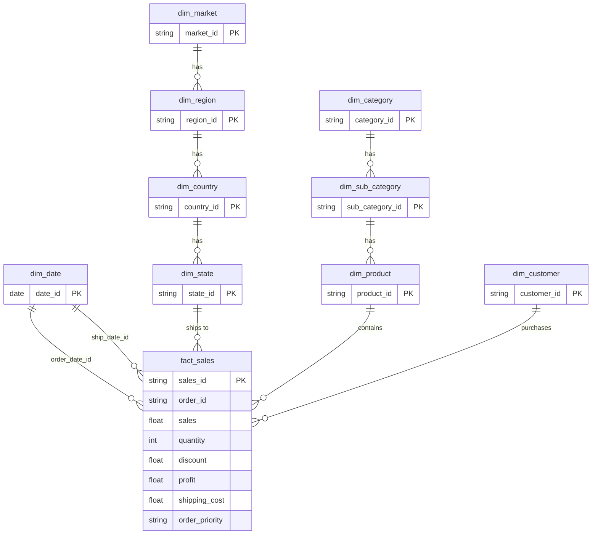

[](README.zh-TW.md)
&nbsp;&nbsp;
[](README.zh-CN.md)


# Superstore Sales & Profit Analysis

**MySQL · Python · Power BI · Data Warehouse**

---

## Project Overview

This project analyzes the [Kaggle Superstore Sales Dataset](https://www.kaggle.com/datasets/laibaanwer/superstore-sales-dataset) to uncover product performance, profitability drivers, and the impact of discount strategies across 7 global markets (2011–2014).

The goal is to support **procurement, inventory planning, and promotion optimization** through structured data modeling and visual analytics.

### What This Project Covers

- Data cleaning and validation using **Python (pandas)**
- Snowflake-style dimensional modeling in **MySQL** (staging → dimensions/facts → views):  
  `vw_sales_full` for row-level SQL/Python analysis; `vw_sales_summary` for pre-aggregated KPI queries
- Bidirectional data reconciliation for pipeline integrity verification
- 3-page interactive dashboard in **Power BI**
- Business insights and actionable recommendations

---

## Dataset

| Item | Detail |
|---|---|
| Source | [Kaggle — Superstore Sales Dataset](https://www.kaggle.com/datasets/laibaanwer/superstore-sales-dataset) by Laiba Anwer |
| Rows | ~51,000+ |
| Time Range | 2011–2014 |
| Coverage | 7 global markets (APAC, EU, US, LATAM, EMEA, Africa, Canada) |
| Key Fields | Order Date, Ship Date, Customer, Segment, Region, Category, Sub-Category, Sales, Quantity, Discount, Profit, Shipping Cost, Order Priority |

---

## Tools & Technologies

| Tool | Purpose |
|---|---|
| Python (pandas) | Data cleaning, validation, audit reporting |
| MySQL | Dimensional modeling, data loading, analytical SQL |
| Power BI | Interactive dashboard and KPI visualization |
| GitHub | Version control and documentation |

---

## 1. Data Cleaning (Python)

### `01_raw_data_preview_cnt.py` — Raw Data Audit
- Generates a full audit report (Excel): descriptive statistics, missing values, unique counts, data types
- Exports row preview (100 rows) and random sample (100 rows) as CSV

### `02_clean_data_cnt.py` — Data Cleaning & Validation
- **Date formatting**: Converts inconsistent formats (DD/MM/YYYY, DD-MM-YYYY) to standard datetime
- **Numeric validation**: Strips currency symbols/commas, coerces to numeric, logs errors to CSV
- **Text standardization**: Removes accents (São Paulo → Sao Paulo), trims whitespace, applies Proper Case
- **Data quality checks**: Decimal precision analysis; product ID ↔ product name conflict detection
- **Missing value handling**: Drops null `order_date` rows; fills missing `discount` and `shipping_cost` with 0

### `03_clean_check_cnt.py` — Post-Clean Verification
- Re-runs the full audit on cleaned data to confirm all issues are resolved

---

## 2. Database Design (MySQL — Snowflake Schema)

Rather than a flat table, this project implements a full **Snowflake Schema** with normalized dimension hierarchies and a central fact table.

### Schema Diagram



### Dimension Tables

| Table | Description | Key Design Decisions |
|---|---|---|
| `dim_date` | 10-year calendar (2011–2020) | Pre-generated with year, quarter, month, day_of_week, is_weekend |
| `dim_customer` | Unique customer + segment | Composite unique key (customer_name, segment) |
| `dim_market` → `dim_region` → `dim_country` → `dim_state` | Geographic hierarchy | Normalized 4-level hierarchy with foreign keys |
| `dim_category` → `dim_sub_category` → `dim_product` | Product hierarchy | Handles 1:N product_id ↔ product_name conflicts via composite key |
| `fact_sales` | Transaction-level facts | Surrogate key (sales_id); preserves duplicate business records |

---

## 3. SQL Pipeline & Data Quality

### Loading & Transformation

| Step | Script | Purpose |
|---|---|---|
| 1 | `01.create_import_staging_cnt.sql` | Create staging table and load cleaned CSV |
| 2 | `02.check_staging_data_cnt.sql` | Verify row/column counts, unique keys, duplicates |
| 3 | `03.create_import_dim_fact_cnt.sql` | Create all dimension and fact tables via multi-table INSERT |

### Bidirectional Reconciliation

| Step | Script | Purpose |
|---|---|---|
| 4 | `04.check_staging_exists_fact_not.sql` | Records in staging missing from fact (loading gaps) |
| 5 | `05.check_fact_exists_staging_not.sql` | Records in fact missing from staging (phantom records) |
| 6 | `08.staging_vs_fact_view.sql` | Compare totals (rows, sales, quantity, profit) across all layers |

### Views & Indexes

| Step | Script | Purpose |
|---|---|---|
| 7 | `06.create_view.sql` | `vw_sales_full` — row-level flattened view for SQL ad-hoc analysis and Python EDA |
| 8 | `09.index.sql` | `vw_sales_summary` — pre-aggregated view by time/segment/region/category for KPI queries; indexes on `fact_sales` |
| 9 | `07.check_fact_vw_distinct.sql` | Verify distinct value counts across fact table and view |

---

## 4. SQL Analysis

### Key Business Questions

**Which categories generate the highest sales and profit?**
```sql
SELECT category_name,
       ROUND(SUM(total_sales), 0)  AS sales,
       ROUND(SUM(total_profit), 0) AS profit,
       ROUND(AVG(profit_margin_pct), 1) AS avg_margin_pct
FROM vw_sales_summary
GROUP BY category_name
ORDER BY sales DESC;
```

**How do discounts affect profitability?**
```sql
SELECT
    CASE
        WHEN discount = 0        THEN 'No Discount'
        WHEN discount <= 0.10    THEN 'Low (0–10%)'
        WHEN discount <= 0.30    THEN 'Medium (11–30%)'
        ELSE                          'High (>30%)'
    END AS discount_band,
    SUM(sales)   AS total_sales,
    SUM(profit)  AS total_profit,
    ROUND(SUM(profit) / NULLIF(SUM(sales), 0) * 100, 2) AS profit_margin_pct
FROM vw_sales_full
GROUP BY discount_band
ORDER BY profit_margin_pct DESC;
```

---

## 5. Power BI Dashboard (3 Pages)

### Page 1: Executive Summary


- **KPI Cards**: Sales ($4.30M), Profit ($504K), ROI (13.28%), Sales YoY (+26.25%), Avg Margin (11.72%)
- **Sales Trend**: Monthly comparison (2013 vs 2014) highlighting seasonal patterns
- **Top 10 Sub-Categories**: Sales, profit, margin table with conditional formatting (negative margins flagged)
- **Market Distribution**: Pie chart — APAC (28%), EU (24%), US (17%), LATAM (16%), EMEA (7%)
- **ABC Analysis**: Sub-category classification by sales and profit contribution
- **Slicers**: Segment, Category

### Page 2: Product Performance


- Category profitability comparison (Technology 14%, Office Supplies 14%, Furniture 7%)
- Sub-category year-over-year sales and profit bar charts (2011–2014)
- ABC Treemap for visual sub-category classification
- Segment and category sales distribution pie charts

### Page 3: Promotion Impact


- **Scatter Plot**: Avg Discount % vs Avg Margin % by sub-category (bubble size = quantity)
- **Discount Impact Charts**: Sales and profit distribution by discount level across years
- **ROI by Sub-Category**: Ranking from Paper (highest) to Tables (negative ROI)
- Profit trend year-over-year

---

## Key Insights

### KPI Summary (2014)

| KPI | Actual | vs. Target |
|---|---|---|
| Total Sales | $4.30M | +14.78% above target |
| Total Profit | $504K | +12.20% above target |
| ROI | 13.28% | +32.28% above target (10%) |
| Sales YoY Growth | +26.25% | +$894K vs. 2013 |
| Avg Margin | 11.72% | Weighted average across all transactions |

### Category Performance

| Category | Sales | Profit Margin | Assessment |
|---|---|---|---|
| Technology | $4.74M | 13.99% | Core growth engine — highest sales and margin |
| Office Supplies | $3.79M | 13.69% | Stable profit source |
| Furniture | $4.11M | 6.98% | High volume, significantly lower margin — cost review needed |

- **Segment**: Consumer drives 51.48% of total sales; Home Office delivers the highest margin at 11.99%
- **Top sub-categories by sales**: Phones ($552K), Copiers ($550K), Bookcases ($513K)
- **Top sub-categories by margin**: Copiers (18.9%), Accessories (16.4%), Appliances (14.7%)
- **Warning**: Tables margin at -12.55%, recording a net loss of -$30K

### ABC Classification (by Sales Contribution)

| Class | Sub-categories | Note |
|---|---|---|
| A (top 70%) | Phones, Copiers, Chairs, Bookcases, Storage, Appliances | Core revenue drivers |
| B (next 20%) | Machines, Tables, Accessories, Binders | Tables: only item with 4 consecutive years of negative profit |
| C (bottom 10%) | Furnishings, Art, Paper, Supplies, Envelopes, Fasteners, Labels | Low volume, monitor only |

### Discount Impact

| Discount Band | Profit Margin | Assessment |
|---|---|---|
| No Discount | 25.32% | Healthiest — strong demand without incentives |
| Low (0–10%) | 16.56% | Best balance of volume and profit |
| Medium (11–30%) | 7.11% | Thin margin — use cautiously |
| High (>30%) | **-40.65%** | Net loss territory — avoid |
---

## Business Recommendations

1. **Cap discounts at 10%** — Discounts above 30% generate an average margin of -40.65%. For top performers like Copiers, a 10% discount generates 75% more sales volume than 20% discount, proving deeper discounts are unnecessary.

2. **Investigate Tables urgently** — Tables recorded negative profit (-12.55% margin, ROI -11.15%) for all 4 consecutive years. In 2014, sales increased 20% YoY but net losses doubled to 200% of the prior year. Suspending promotions above 20% discount and reviewing cost structure is recommended before any further markdowns.

3. **Review Furniture cost structure** — Furniture is the 2nd-highest revenue category ($4.11M) but delivers only 6.98% margin vs. Technology's 13.99%. Within Furniture, Chairs (9.45%) and Storage (9.62%) are A-class by sales volume but significantly underperform on margin.

4. **Double down on Technology and Copiers** — Technology combines the highest revenue share (37.53%) and margin (13.99%). Copiers specifically achieve ROI of 23%, well above the 10% target, making them the single highest-value sub-category.

5. **Recalibrate Machines discount ceiling** — Machines ROI of 7.71% is below the 10% target, driven by excessive 50% discount transactions that generate negative profit. Reference 2012 performance (ROI 10.66%) to reset the discount ceiling and recover approximately 3% margin.

6. **Monitor A-class underperformers** — Chairs (ROI 9.12%) fell below the 10% target in 2014, driven by an increase in 25–27% discount transactions. Limiting promotions above 20% for Chairs is recommended to prevent further margin erosion.

7. **Replace blanket discounts with sub-category-specific pricing strategies** — Each A-class sub-category warrants its own discount cap derived from observed margin curves, rather than applying a uniform promotional rate across the portfolio.

---

## Project Structure

```
01_Superstore_Sales_Analysis/
│
├── data/                                            # Raw source dataset (CSV)
├── scripts/
│   ├── 01_raw_data_preview_cnt.py                   # Raw data audit
│   ├── 02_clean_data_cnt.py                         # Data cleaning & validation
│   └── 03_clean_audit_cnt.py                        # Post-clean verification
├── output/                                          # Generated files from pipeline scripts (audit reports, cleaned CSVs)
├── sql/
│   ├── 01–08 pipeline scripts                       # Staging → dimensions → fact → views
│   ├── 09.index.sql                                 # Indexes & summary view
│   ├── analyst/                                     # Analytical queries
│   └── utils/                                       # Utility scripts (drop_table.sql, test_powerbi.sql)
├── powerBI/
│   ├── superstore.pbix                              # Power BI dashboard
│   └── superstore.pdf                               # Dashboard export (3 pages)
├── screenshot/                                      # Dashboard screenshots
└── README.md
```

---

## How to Reproduce

**Prerequisites**: Python 3.8+, MySQL 8.0+, Power BI Desktop

1. Download `superstore.csv` from [Kaggle](https://www.kaggle.com/datasets/laibaanwer/superstore-sales-dataset)
2. Run `python scripts/01_raw_data_preview_cnt.py` to generate the raw data audit report
3. Run `python scripts/02_clean_data_cnt.py` to clean and validate the data
4. Execute SQL scripts in order (`01` → `08`) in MySQL
5. Open `superstore.pbix` in Power BI Desktop and connect to your MySQL instance.  
   Import the following tables directly (Star Schema):  
   - **Fact**: `fact_sales`  
   - **Dimensions**: `dim_date` *(mark as Date Table)*, `dim_customer`, `dim_product`, `dim_sub_category`, `dim_category`, `dim_state`, `dim_country`, `dim_region`, `dim_market`   
   - **Note**: `vw_sales_full` is for SQL/Python ad-hoc analysis; `vw_sales_summary` is for MySQL KPI queries. Neither is used as the Power BI data source.

---

## Author

Ross Tang | [GitHub](https://github.com/ross-bi)

## License

This project is licensed under the MIT License. See the [LICENSE](./LICENSE) file for details.
