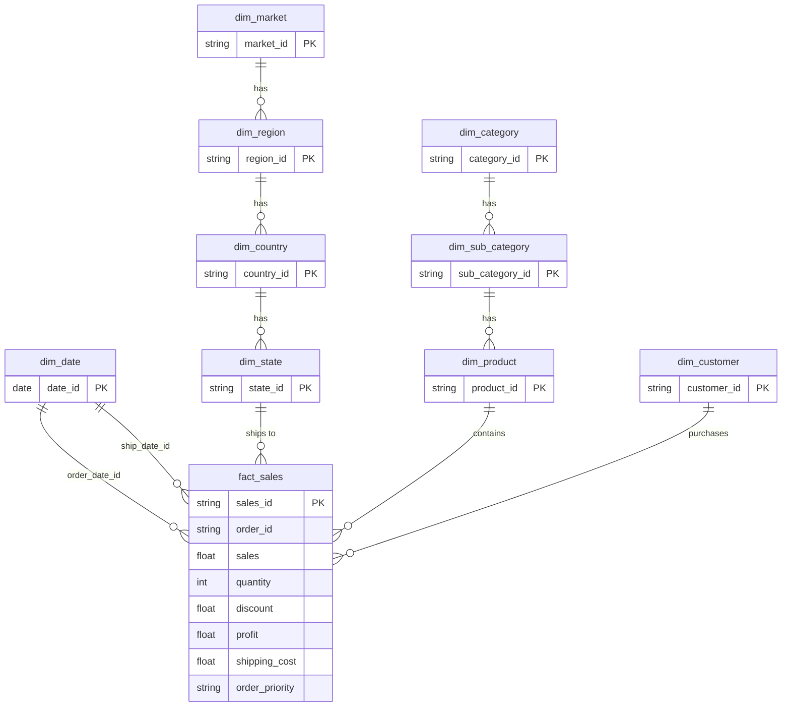

[](README.md)
&nbsp;&nbsp;
[](README.zh-TW.md)

# 超市销售与利润分析

**MySQL · Python · Power BI · Data Warehouse**

---

## 专案概述

本项目分析 [Kaggle Superstore 销售数据集](https://www.kaggle.com/datasets/laibaanwer/superstore-sales-dataset)，深入探讨 2011–2014 年间全球 7 个市场的产品表现、获利驱动因素及折扣策略影响。

目标是透过结构化数据建模与可视化分析，支持**采购决策、库存规划与促销优化**。

### 项目涵盖范围

- 使用 **Python (pandas)** 进行数据清洗与验证
- 在 **MySQL** 中建立 Snowflake 式维度模型（staging → 维度/事实表 → 视图）：  
  `vw_sales_full` 供行级 SQL/Python 分析；`vw_sales_summary` 供预先汇总的 KPI 查询
- 双向数据检验以验证数据管道完整性
- 在 **Power BI** 中建立 3 页交互式仪表板
- 业务洞察与可行建议

---

## 数据集

| 项目 | 详细信息 |
|---|---|
| 来源 | [Kaggle — Superstore Sales Dataset](https://www.kaggle.com/datasets/laibaanwer/superstore-sales-dataset)，作者：Laiba Anwer |
| 笔数 | ~51,000+ |
| 时间范围 | 2011–2014 |
| 涵盖范围 | 全球 7 个市场（APAC、EU、US、LATAM、EMEA、Africa、Canada） |
| 主要字段 | 订单日期、出货日期、客户、客户类别、地区、产品类别、子类别、销售额、数量、折扣、利润、运费、订单优先级 |

---

## 工具与技术

| 工具 | 用途 |
|---|---|
| Python (pandas) | 资料清洗、验证、稽核报告 |
| MySQL | 维度建模、数据加载、分析 SQL |
| Power BI | 交互式仪表板与 KPI 可视化 |
| GitHub | 版本控制与文件管理 |

---

## 1. 资料清洗（Python）

### `01_raw_data_preview_cnt.py` — 原始资料稽核
- 生成完整稽核报告（Excel）：描述性统计、缺失值、唯一值计数、资料型别
- 汇出行预览（100 笔）与随机样本（100 笔）为 CSV

### `02_clean_data_cnt.py` — 数据清洗与验证
- **日期格式化**：将不一致格式（DD/MM/YYYY、DD-MM-YYYY）统一转换为标准 datetime
- **数值验证**：去除货币符号与逗号，强制转换为值类型，并将错误记录至 CSV
- **文字标准化**：移除重音符号（São Paulo → Sao Paulo）、去除空白、统一首字母大写
- **数据质量检查**：小数精度分析；侦测 product ID ↔ product name 冲突
- **缺失值处理**：删除 `order_date` 为空的列；以 0 填补缺失的 `discount` 与 `shipping_cost`

### `03_clean_check_cnt.py` — 清洗后验证
- 对清洗后的数据重新执行完整稽核，确认所有问题已解决

---

## 2. 数据库设计（MySQL — Snowflake Schema）

本项目不采用平面表格，而是实作完整的 **Snowflake Schema**，包含正规化的维度层级与中央事实表。

### Schema 图



### 维度表

| 表格 | 说明 | 主要设计决策 |
|---|---|---|
| `dim_date` | 10 年日历（2011–2020） | 预先生成，含 year、quarter、month、day_of_week、is_weekend |
| `dim_customer` | 唯一客户 + 客户类别 | 复合唯一键（customer_name, segment） |
| `dim_market` → `dim_region` → `dim_country` → `dim_state` | 地理层级 | 正规化 4 层层级，使用外键关联 |
| `dim_category` → `dim_sub_category` → `dim_product` | 产品层级 | 透过组合键处理 product_id ↔ product_name 的 1:N 冲突 |
| `fact_sales` | 交易级事实数据 | 代理键（sales_id）；保留重复的业务记录 |

---

## 3. SQL 管道与数据质量

### 加载与转换

| 步骤 | 脚本 | 用途 |
|---|---|---|
| 1 | `01.create_import_staging_cnt.sql` | 建立 staging 表并加载已清洗的 CSV |
| 2 | `02.check_staging_data_cnt.sql` | 验证列数/栏数、唯一键、重复值 |
| 3 | `03.create_import_dim_fact_cnt.sql` | 透过多表 INSERT 建立所有维度表与事实表 |

### 双向核对

| 步骤 | 脚本 | 用途 |
|---|---|---|
| 4 | `04.check_staging_exists_fact_not.sql` | staging 有但 fact 缺少的记录（加载遗漏） |
| 5 | `05.check_fact_exists_staging_not.sql` | fact 有但 staging 缺少的记录（幽灵记录） |
| 6 | `08.staging_vs_fact_view.sql` | 比较所有层级的总计（列数、销售额、数量、利润） |

### 视图与索引

| 步骤 | 脚本 | 用途 |
|---|---|---|
| 7 | `06.create_view.sql` | `vw_sales_full` — 行级 flattened 视图，供 SQL ad-hoc 分析与 Python EDA 使用 |
| 8 | `09.index.sql` | `vw_sales_summary` — 按时间/客户类别/地区/产品类别预先汇总的 KPI 查询视图；建立 `fact_sales` 索引 |
| 9 | `07.check_fact_vw_distinct.sql` | 验证事实表与视图的唯一值计数 |

---

## 4. SQL 分析

### 主要业务问题

**哪些产品类别的销售额与利润最高？**
```sql
SELECT category_name,
       ROUND(SUM(total_sales), 0)  AS sales,
       ROUND(SUM(total_profit), 0) AS profit,
       ROUND(AVG(profit_margin_pct), 1) AS avg_margin_pct
FROM vw_sales_summary
GROUP BY category_name
ORDER BY sales DESC;
```

**折扣对获利能力有何影响？**
```sql
SELECT
    CASE
        WHEN discount = 0        THEN '无折扣'
        WHEN discount <= 0.10    THEN '低折扣（0–10%）'
        WHEN discount <= 0.30    THEN '中折扣（11–30%）'
        ELSE                          '高折扣（>30%）'
    END AS discount_band,
    SUM(sales)   AS total_sales,
    SUM(profit)  AS total_profit,
    ROUND(SUM(profit) / NULLIF(SUM(sales), 0) * 100, 2) AS profit_margin_pct
FROM vw_sales_full
GROUP BY discount_band
ORDER BY profit_margin_pct DESC;
```

---

## 5. Power BI 仪表板（3 页）

### 第 1 页：高层摘要


- **KPI 卡片**：销售额（$4.30M）、利润（$504K）、ROI（13.28%）、销售额 YoY（+26.25%）、平均利润率（11.72%）
- **销售趋势**：月度对比（2013 vs 2014），突显季节性规律
- **前 10 子类别**：销售额、利润、利润率表格，含条件格式（负利润率标红）
- **市场分布**：圆饼图 — APAC（28%）、EU（24%）、US（17%）、LATAM（16%）、EMEA（7%）
- **ABC 分析**：按销售额与利润贡献度分类子类别
- **筛选器**：客户类别、产品类别

### 第 2 页：产品表现


- 产品类别获利比较（Technology 14%、Office Supplies 14%、Furniture 7%）
- 子类别年度销售额与利润直方图（2011–2014）
- ABC 树形图，可视化子类别分类
- 客户类别与产品类别销售分布圆饼图

### 第 3 页：促销影响


- **散点图**：各子类别平均折扣率 vs 平均利润率（气泡大小 = 数量）
- **折扣影响图表**：各年度不同折扣级别的销售额与利润分布
- **子类别 ROI 排名**：从 Paper（最高）到 Tables（负 ROI）
- 利润年度趋势

---

## 主要洞察

### KPI 总览（2014 年）

| KPI | 实际值 | 与目标比较 |
|---|---|---|
| 总销售额 | $4.30M | 超越目标 +14.78% |
| 总利润 | $504K | 超越目标 +12.20% |
| ROI | 13.28% | 超越目标 +32.28%（目标 10%） |
| 销售年增率 | +26.25% | 较 2013 年增加 $894K |
| 平均毛利率 | 11.72% | 加权平均毛利率 |

### 品类表现

| 品类 | 销售额 | 毛利率 | 评估 |
|---|---|---|---|
| Technology | $4.74M | 13.99% | 核心成长引擎 — 最高销售额与毛利率 |
| Office Supplies | $3.79M | 13.69% | 稳定利润来源 |
| Furniture | $4.11M | 6.98% | 高销售量、毛利率明显偏低 — 需检视成本结构 |

- **Segment**：Consumer 占整体销售 51.48%；Home Office 毛利率最高，达 11.99%
- **高销售子类别**：Phones（$552K）、Copiers（$550K）、Bookcases（$513K）
- **高毛利率子类别**：Copiers（18.9%）、Accessories（16.4%）、Appliances（14.7%）
- **警示项目**：Tables 毛利率 -12.55%，净亏损 -$30K

### ABC 分类分析（依销售贡献）

| 等级 | 子类别 | 备注 |
|---|---|---|
| A 类（前 70%） | Phones、Copiers、Chairs、Bookcases、Storage、Appliances | 核心收入驱动项目 |
| B 类（次 20%） | Machines、Tables、Accessories、Binders | Tables：唯一连续 4 年负利润项目 |
| C 类（后 10%） | Furnishings、Art、Paper、Supplies、Envelopes、Fasteners、Labels | 低销量，持续监控即可 |

### 折扣影响分析

| 折扣区间 | 毛利率 | 评估 |
|---|---|---|
| 无折扣 | 25.32% | 最健康 — 无需折扣即有强劲需求 |
| 低（0–10%） | 16.56% | 销量与利润的最佳平衡点 |
| 中（11–30%） | 7.11% | 利润率偏薄 — 谨慎使用 |
| 高（>30%） | **-40.65%** | 净亏损区域 — 应避免 |
---

## 业务建议

1. **将折扣上限设为 10%** — 超过 30% 的折扣平均毛利率为 -40.65%。以 Copiers 为例，10% 折扣的销售量比 20% 折扣高出 75%，证明更深幅折扣并无必要。

2. **紧急检视 Tables** — Tables 连续 4 年录得负利润（毛利率 -12.55%，ROI -11.15%）。2014 年销售额虽按年增长 20%，但净亏损扩大至上年的 200%。建议暂停 20% 以上折扣促销，先行检视成本结构，再考虑任何进一步降价策略。

3. **检视 Furniture 成本结构** — Furniture 是第二大销售品类（$4.11M），但毛利率仅 6.98%，远低于 Technology 的 13.99%。其中 Chairs（9.45%）与 Storage（9.62%）虽属 A 类销售项目，毛利率表现却明显落后。

4. **加强投资 Technology 与 Copiers** — Technology 同时拥有最高销售占比（37.53%）与最高毛利率（13.99%）。Copiers 的 ROI 达 23%，远超 10% 目标，是整体表现最突出的子类别。

5. **重新校正 Machines 折扣上限** — Machines ROI 为 7.71%，低于 10% 目标，主因是 50% 折扣交易过多，导致负利润增加。建议参考 2012 年表现（ROI 10.66%）重设折扣上限，目标恢复约 3% 的正利润。

6. **监控 A 类表现偏弱项目** — Chairs ROI 在 2014 年降至 9.12%，低于 10% 目标，主因是 25–27% 折扣交易增加。建议限制 Chairs 20% 以上折扣活动，避免利润进一步受损。

7. **以子类别专属定价策略取代统一折扣政策** — 每个 A 类子类别应根据各自的毛利率曲线，设定独立的折扣上限，而非沿用统一促销幅度。


---

## 项目结构
```
01_Superstore_Sales_Analysis/
│
├── data/ # 原始数据集（CSV）
├── scripts/
│ ├── 01_raw_data_preview_cnt.py # 原始资料稽核
│ ├── 02_clean_data_cnt.py # 数据清洗与验证
│ └── 03_clean_audit_cnt.py # 清洗后验证
├── output/ # 脚本生成的输出档案
│ ├── 01–04 管道脚本 # 原始稽核预览 → 清洗预览 → 清洗后汇入 → 清洗后稽核
├── sql/
│ ├── 01–08 管道脚本 # Staging → 维度表 → 事实表 → 视图
│ ├── 09.index.sql # 索引与汇总视图
│ └── analyst/ # 分析查询
├── powerBI/
│ ├── superstore.pbix # Power BI 仪表板
│ └── superstore.pdf # 仪表板汇出（3 页）
├── screenshot/ # 仪表板截图
└── README.md
```

---

## 重现步骤

**前置条件**：Python 3.8+、MySQL 8.0+、Power BI Desktop

1. 从 [Kaggle](https://www.kaggle.com/datasets/laibaanwer/superstore-sales-dataset) 下载 `superstore.csv`
2. 执行 `python scripts/02_clean_data_cnt.py`
3. 依序在 MySQL 执行 SQL 脚本（`01` → `08`）
4. 在 Power BI Desktop 开启 `superstore.pbix` 并连接至你的 MySQL 数据库。  
   直接汇入以下数据表（Star Schema）：  
   - **事实表**：`fact_sales`  
   - **维度表**：`dim_date` *（设定为 Date Table）*、`dim_customer`、`dim_product`、`dim_sub_category`、`dim_category`、`dim_state`、`dim_country`、`dim_region`、`dim_market`   
   - **注意**：`vw_sales_full` 供 SQL/Python ad-hoc 分析使用；`vw_sales_summary` 供 MySQL KPI 查询使用。两者均不作为 Power BI 数据源。

---

## 作者

Ross Tang | [GitHub](https://github.com/ross-bi)

## 授权

本项目采用 MIT 授权条款。详情请参阅 [LICENSE](./LICENSE) 文件。

