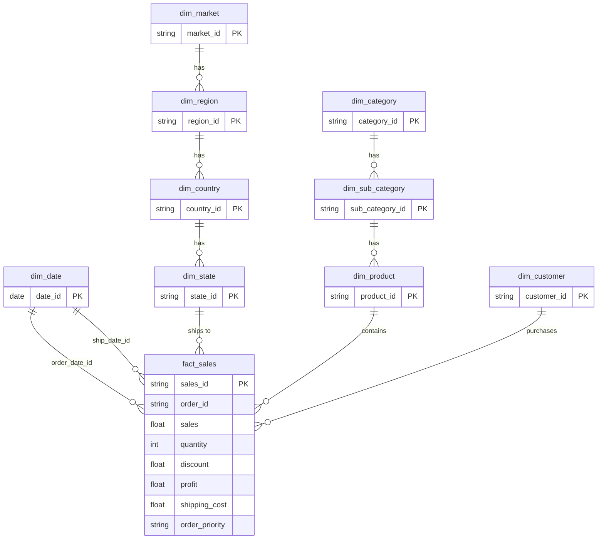

[](README.md)
&nbsp;&nbsp;
[](README.zh-TW.md)

# Superstore 销售与利润分析

**MySQL · Python · Power BI · 数据仓库**

---

## 项目概述

本项目分析 [Kaggle Superstore Sales Dataset](https://www.kaggle.com/datasets/laibaanwer/superstore-sales-dataset)，以挖掘产品表现、盈利驱动因素，以及折扣策略对 7 个全球市场（2011–2014）的影响。

本项目的目标是通过结构化数据建模与可视化分析，支持**采购决策、库存规划与促销优化**。

### 本项目涵盖内容

- 使用 **Python（pandas）** 进行数据清洗与验证
- 使用 **MySQL** 建立 Snowflake-style 维度模型（staging → dimensions/facts → views）  
  `vw_sales_full` 用于 row-level SQL / Python 分析；`vw_sales_summary` 用于预聚合 KPI 查询
- 双向数据核对（bidirectional reconciliation）以验证数据流程完整性
- 使用 **Power BI** 制作 3 页交互式仪表板
- 商业洞察与可执行建议

---

## 数据集

| 项目 | 说明 |
|---|---|
| 来源 | [Kaggle — Superstore Sales Dataset](https://www.kaggle.com/datasets/laibaanwer/superstore-sales-dataset) by Laiba Anwer |
| 记录数 | 约 51,000+ |
| 时间范围 | 2011–2014 |
| 覆盖范围 | 7 个全球市场（APAC、EU、US、LATAM、EMEA、Africa、Canada） |
| 主要字段 | Order Date、Ship Date、Customer、Segment、Region、Category、Sub-Category、Sales、Quantity、Discount、Profit、Shipping Cost、Order Priority |

---

## 工具与技术

| 工具 | 用途 |
|---|---|
| Python (pandas) | 数据清洗、验证、审计报告 |
| MySQL | 维度建模、数据加载、分析 SQL |
| Power BI | 交互式仪表板与 KPI 可视化 |
| GitHub | 版本控制与文档管理 |

---

## 1. 数据清洗（Python）

### `01_raw_data_preview_cnt.py` — 原始数据审计
- 生成完整审计报告（Excel）：描述统计、缺失值、唯一值数量、数据类型
- 导出前 100 行数据预览和 100 行随机样本为 CSV

### `02_clean_data_cnt.py` — 数据清洗与验证
- **日期格式处理**：将不一致格式（DD/MM/YYYY、DD-MM-YYYY）转换为标准 datetime
- **数值验证**：移除货币符号和千分位逗号，转换为数值，并将错误记录输出为 CSV
- **文本标准化**：去除重音符号（São Paulo → Sao Paulo）、清理前后空格、统一为 Proper Case
- **数据质量检查**：分析小数精度；检查 product ID ↔ product name 冲突
- **缺失值处理**：删除 `order_date` 为空的行；将 `discount` 和 `shipping_cost` 的空值补为 0

### `03_clean_check_cnt.py` — 清洗后验证
- 重新执行完整审计，以确认所有数据问题已修复

---

## 2. 数据库设计（MySQL — Snowflake Schema）

本项目并非采用单一平面表，而是构建完整的 **Snowflake Schema**，以规范化的维度层级配合中央事实表。

### Schema 图



### 维度表

| 数据表 | 说明 | 设计重点 |
|---|---|---|
| `dim_date` | 10 年日历表（2011–2020） | 预先生成 year、quarter、month、day_of_week、is_weekend |
| `dim_customer` | 唯一 customer + segment | 采用复合唯一键（customer_name, segment） |
| `dim_market` → `dim_region` → `dim_country` → `dim_state` | 地理层级 | 规范化 4 层地理结构并建立 foreign keys |
| `dim_category` → `dim_sub_category` → `dim_product` | 产品层级 | 通过复合键处理 product_id ↔ product_name 的 1:N 冲突 |
| `fact_sales` | 交易级事实表 | 使用 surrogate key（sales_id）；保留重复业务记录 |

---

## 3. SQL 流程与数据质量

### 加载与转换

| 步骤 | 脚本 | 用途 |
|---|---|---|
| 1 | `01.create_import_staging_cnt.sql` | 创建 staging table 并加载清洗后的 CSV |
| 2 | `02.check_staging_data_cnt.sql` | 验证行数、列数、唯一键与重复值 |
| 3 | `03.create_import_dim_fact_cnt.sql` | 创建所有维度表与事实表，并执行 multi-table INSERT |

### 双向核对

| 步骤 | 脚本 | 用途 |
|---|---|---|
| 4 | `04.check_staging_exists_fact_not.sql` | staging 中存在但 fact 中缺失的数据（加载缺口） |
| 5 | `05.check_fact_exists_staging_not.sql` | fact 中存在但 staging 中缺失的数据（异常记录） |
| 6 | `08.staging_vs_fact_view.sql` | 比较各层总量（rows、sales、quantity、profit） |

### Views 与 Indexes

| 步骤 | 脚本 | 用途 |
|---|---|---|
| 7 | `06.create_view.sql` | `vw_sales_full` — 展平后的 row-level view，供 SQL ad-hoc 分析与 Python EDA 使用 |
| 8 | `09.index.sql` | `vw_sales_summary` — 按时间 / segment / region / category 预聚合的 view，用于 KPI 查询；并建立 `fact_sales` 索引 |
| 9 | `07.check_fact_vw_distinct.sql` | 验证 fact table 与 view 的 distinct value 数量一致性 |

---

## 4. SQL 分析

### 分析查询文件（`sql/analyst/`）

| 文件 | 数据来源 View | 说明 |
|---|---|---|
| `product_sales_by_month.sql` | `vw_sales_full` | 按产品 × 年月汇总 sales、quantity、discount、profit |
| `product_sales_by_year.sql` | `vw_sales_full` | 按产品 × 年份汇总 sales、quantity、profit |
| `product_profit_summary.sql` | `vw_sales_full` | 按产品汇总 sales、quantity、profit、shipping cost（全周期） |
| `geo_sales_by_category.sql` | `vw_sales_full` | 按 market / country / state × category / sub-category 汇总销售与利润 |
| `category_profit_summary.sql` | `vw_sales_summary` | 类别层级 sales、profit 与加权 margin 分析 |
| `discount_band_profitability.sql` | `vw_sales_full` | 折扣区间（无 / 低 / 中 / 高）对 sales 与 profit margin 的影响 |

### 关键业务问题

**哪些类别带来最高的销售与利润？**
```sql
-- category_profit_summary.sql
SELECT
    category_name,
    ROUND(SUM(total_sales), 0)  AS sales,
    ROUND(SUM(total_profit), 0) AS profit,
    ROUND(
        SUM(total_profit) / NULLIF(SUM(total_sales), 0) * 100
    , 1)                         AS margin_pct
FROM vw_sales_summary
GROUP BY category_name
ORDER BY sales DESC;
```

**折扣如何影响盈利能力？**
```sql
-- discount_band_profitability.sql
SELECT
    CASE
        WHEN discount = 0        THEN 'No Discount'
        WHEN discount <= 0.10    THEN 'Low (0–10%)'
        WHEN discount <= 0.30    THEN 'Medium (11–30%)'
        ELSE                          'High (>30%)'
    END AS discount_band,
    SUM(sales)   AS total_sales,
    SUM(profit)  AS total_profit,
    ROUND(SUM(profit) / NULLIF(SUM(sales), 0) * 100, 2) AS profit_margin_pct
FROM vw_sales_full
GROUP BY discount_band
ORDER BY profit_margin_pct DESC;
```

---

## 5. Power BI 仪表板（3 页）

### 第 1 页：Executive Summary


- **KPI Cards**：Sales ($4.30M)、Profit ($504K)、ROI (13.28%)、Sales YoY (+26.25%)、Avg Margin (11.72%)
- **Sales Trend**：2013 vs 2014 月度对比，观察季节性模式
- **Top 10 Sub-Categories**：销售、利润、margin 排名表，负 margin 用条件格式标记
- **Market Distribution**：饼图 — APAC (28%)、EU (24%)、US (17%)、LATAM (16%)、EMEA (7%)
- **ABC Analysis**：按销售与利润贡献对 sub-category 进行分级
- **Slicers**：Segment、Category

### 第 2 页：Product Performance


- 类别盈利能力对比（Technology 14%、Office Supplies 14%、Furniture 7%）
- Sub-category 2011–2014 年 sales 与 profit 柱状图
- ABC Treemap 展示 sub-category 分级
- Segment 与 Category 销售分布饼图

### 第 3 页：Promotion Impact


- **Scatter Plot**：Sub-category 的平均折扣率 vs 平均 margin（气泡大小 = quantity）
- **Discount Impact Charts**：不同折扣层级在各年份的 sales 与 profit 分布
- **ROI by Sub-Category**：从 Paper（最高）到 Tables（负 ROI）的排名
- 年度 profit 趋势

---

## 关键洞察

### KPI 摘要（2014）

| KPI | 实际值 | 相对目标 |
|---|---|---|
| Total Sales | $4.30M | 高于目标 14.78% |
| Total Profit | $504K | 高于目标 12.20% |
| ROI | 13.28% | 高于目标（10%）32.28% |
| Sales YoY Growth | +26.25% | 较 2013 增加 $894K |
| Avg Margin | 11.72% | 所有交易的加权平均 |

### 类别表现

| Category | Sales | Profit Margin | 评估 |
|---|---|---|---|
| Technology | $4.74M | 13.99% | 核心增长引擎，销售与利润率最高 |
| Office Supplies | $3.79M | 13.69% | 稳定的利润来源 |
| Furniture | $4.11M | 6.98% | 高营收但利润率明显偏低，需审查成本 |

- **Segment**：Consumer 贡献 51.48% 的总销售；Home Office 拥有最高 margin（11.99%）
- **销售额最高的 sub-categories**：Phones ($552K)、Copiers ($550K)、Bookcases ($513K)
- **利润率最高的 sub-categories**：Copiers (18.9%)、Accessories (16.4%)、Appliances (14.7%)
- **预警**：Tables 的 margin 为 -12.55%，净亏损 -$30K

### ABC 分类（按销售贡献）

| 类别 | Sub-categories | 说明 |
|---|---|---|
| A（前 70%） | Phones、Copiers、Chairs、Bookcases、Storage、Appliances | 核心营收来源 |
| B（接续 20%） | Machines、Tables、Accessories、Binders | Tables 是唯一连续 4 年亏损的项目 |
| C（最后 10%） | Furnishings、Art、Paper、Supplies、Envelopes、Fasteners、Labels | 规模较小，持续监控即可 |

### 折扣影响

| Discount Band | Profit Margin | 评估 |
|---|---|---|
| No Discount | 25.32% | 最健康，说明需求强且无需额外促销 |
| Low (0–10%) | 16.56% | 销量与利润的最佳平衡 |
| Medium (11–30%) | 7.11% | 利润偏薄，需谨慎使用 |
| High (>30%) | **-40.65%** | 已进入净亏损区间，应避免 |

---

## 业务建议

1. **将折扣上限控制在 10%** — 超过 30% 的折扣平均 margin 为 -40.65%。对于 Copiers 这类高表现品类，10% 折扣带来的销量比 20% 折扣高出 75%，说明更深折扣并无必要。

2. **优先调查 Tables** — Tables 连续 4 年保持负利润（margin -12.55%、ROI -11.15%）。2014 年虽然 sales 同比增长 20%，但净亏损却扩大到前一年的 200%。建议暂停 20% 以上促销，并优先检查成本结构。

3. **重新审视 Furniture 成本结构** — Furniture 是第二高营收类别（$4.11M），但 margin 仅 6.98%，远低于 Technology 的 13.99%。其中 Chairs（9.45%）和 Storage（9.62%）虽属于 A 类销售主力，但 margin 表现偏弱。

4. **加大对 Technology 和 Copiers 的投入** — Technology 同时具备最高营收占比（37.53%）和最高 margin（13.99%）。其中 Copiers 的 ROI 达 23%，显著高于 10% 目标，是最具价值的 sub-category。

5. **重新设定 Machines 的折扣上限** — Machines 的 ROI 为 7.71%，低于 10% 目标，主要是由于 50% 折扣交易过多，导致负利润。可参考 2012 年表现（ROI 10.66%）反推更合理的折扣上限，预计可恢复约 3% margin。

6. **关注 A 类中表现偏弱的品项** — Chairs 在 2014 年 ROI 为 9.12%，低于 10% 目标，主要受 25–27% 折扣交易增加影响。建议限制 Chairs 超过 20% 的促销，以防利润继续恶化。

7. **以 sub-category 为单位制定折扣策略，替代统一折扣政策** — 每个 A 类 sub-category 都应根据各自的 margin curve 设定独立折扣上限，而不是使用统一促销比例。

---

## 项目结构

```text
01_Superstore_Sales_Analysis/
│
├── data/                                            # 原始数据集（CSV）
├── scripts/
│   ├── 01_raw_data_preview_cnt.py                   # 原始数据审计
│   ├── 02_clean_data_cnt.py                         # 数据清洗与验证
│   └── 03_clean_audit_cnt.py                        # 清洗后验证
├── output/                                          # 流程输出文件（审计报告、清洗后 CSV）
├── sql/
│   ├── 01–08 pipeline scripts                       # Staging → dimensions → fact → views
│   ├── 09.index.sql                                 # 索引与 summary view
│   ├── analyst/                                     # 分析查询
│   │   ├── product_sales_by_month.sql               # Product × year-month
│   │   ├── product_sales_by_year.sql                # Product × year
│   │   ├── product_profit_summary.sql               # Product 全周期利润摘要
│   │   ├── geo_sales_by_category.sql                # Market / country / state × category
│   │   ├── category_profit_summary.sql              # Category 销售、利润与 margin
│   │   └── discount_band_profitability.sql          # 折扣区间对利润的影响
│   └── utils/                                       # 工具脚本（drop_table.sql、test_powerbi.sql）
├── powerBI/
│   ├── superstore.pbix                              # Power BI 仪表板
│   └── superstore.pdf                               # 仪表板导出（3 页）
├── screenshot/                                      # 仪表板截图
└── README.md
```

---

## 如何复现

**前置要求**：Python 3.8+、MySQL 8.0+、Power BI Desktop

1. 从 [Kaggle](https://www.kaggle.com/datasets/laibaanwer/superstore-sales-dataset) 下载 `superstore.csv`
2. 运行 `python scripts/01_raw_data_preview_cnt.py` 生成原始数据审计报告
3. 运行 `python scripts/02_clean_data_cnt.py` 进行数据清洗与验证
4. 按顺序在 MySQL 中执行 SQL 脚本（`01` → `08`）
5. 使用 Power BI Desktop 打开 `superstore.pbix` 并连接到你的 MySQL instance  
   直接导入以下数据表（Star Schema）：  
   - **Fact**：`fact_sales`  
   - **Dimensions**：`dim_date`（需标记为 Date Table）、`dim_customer`、`dim_product`、`dim_sub_category`、`dim_category`、`dim_state`、`dim_country`、`dim_region`、`dim_market`  
   - **Note**：`vw_sales_full` 用于 SQL / Python ad-hoc 分析；`vw_sales_summary` 用于 MySQL KPI 查询。两者都不是 Power BI 的数据源。

---

## 作者

Ross Tang | [GitHub](https://github.com/ross-bi)

## 许可证

本项目采用 MIT License 许可。详情请参阅 [LICENSE](./LICENSE) 文件。
