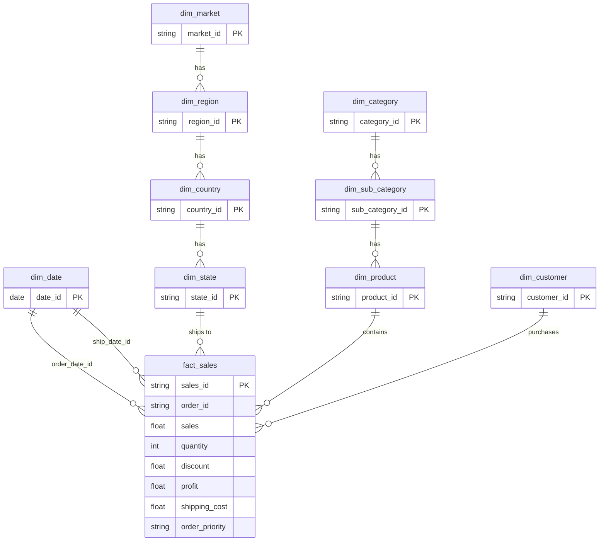

[](README.md)
&nbsp;&nbsp;
[](README.zh-TW.md)

# Superstore 销售与利润分析

**MySQL · Python · Power BI · 数据仓库**

---

## 项目概述

本项目分析 [Kaggle Superstore Sales Dataset](https://www.kaggle.com/datasets/laibaanwer/superstore-sales-dataset)，以挖掘产品表现、盈利驱动因素，以及折扣策略对 7 个全球市场（2011–2014）的影响。

本项目的目标是通过结构化数据建模与可视化分析，支持**采购决策、库存规划与促销优化**。

### 本项目涵盖内容

- 使用 **Python（pandas）** 进行数据清洗与验证
- 使用 **MySQL** 建立 Snowflake-style 维度模型（staging → dimensions/facts → views）  
  `vw_sales_full` 用于 row-level SQL / Python 分析；`vw_sales_summary` 用于预聚合 KPI 查询
- 双向数据核对（bidirectional reconciliation）以验证数据流程完整性
- 使用 **Power BI** 制作 3 页交互式仪表板
- 商业洞察与可执行建议

---

## 数据集

| 项目 | 说明 |
|---|---|
| 来源 | [Kaggle — Superstore Sales Dataset](https://www.kaggle.com/datasets/laibaanwer/superstore-sales-dataset) by Laiba Anwer |
| 记录数 | 约 51,000+ |
| 时间范围 | 2011–2014 |
| 覆盖范围 | 7 个全球市场（APAC、EU、US、LATAM、EMEA、Africa、Canada） |
| 主要字段 | Order Date、Ship Date、Customer、Segment、Region、Category、Sub-Category、Sales、Quantity、Discount、Profit、Shipping Cost、Order Priority |

---

## 工具与技术

| 工具 | 用途 |
|---|---|
| Python (pandas) | 数据清洗、验证、审计报告 |
| MySQL | 维度建模、数据加载、分析 SQL |
| Power BI | 交互式仪表板与 KPI 可视化 |
| GitHub | 版本控制与文档管理 |

---

## 1. 数据清洗（Python）

### `01_raw_data_preview_cnt.py` — 原始数据审计
- 生成完整审计报告（Excel）：描述统计、缺失值、唯一值数量、数据类型
- 导出前 100 行数据预览和 100 行随机样本为 CSV

### `02_clean_data_cnt.py` — 数据清洗与验证
- **日期格式处理**：将不一致格式（DD/MM/YYYY、DD-MM-YYYY）转换为标准 datetime
- **数值验证**：移除货币符号和千分位逗号，转换为数值，并将错误记录输出为 CSV
- **文本标准化**：去除重音符号（São Paulo → Sao Paulo）、清理前后空格、统一为 Proper Case
- **数据质量检查**：分析小数精度；检查 product ID ↔ product name 冲突
- **缺失值处理**：删除 `order_date` 为空的行；将 `discount` 和 `shipping_cost` 的空值补为 0

### `03_clean_check_cnt.py` — 清洗后验证
- 重新执行完整审计，以确认所有数据问题已修复

---

## 2. 数据库设计（MySQL — Snowflake Schema）

本项目并非采用单一平面表，而是构建完整的 **Snowflake Schema**，以规范化的维度层级配合中央事实表。

### Schema 图



### 维度表

| 数据表 | 说明 | 设计重点 |
|---|---|---|
| `dim_date` | 10 年日历表（2011–2020） | 预先生成 year、quarter、month、day_of_week、is_weekend |
| `dim_customer` | 唯一 customer + segment | 采用复合唯一键（customer_name, segment） |
| `dim_market` → `dim_region` → `dim_country` → `dim_state` | 地理层级 | 规范化 4 层地理结构并建立 foreign keys |
| `dim_category` → `dim_sub_category` → `dim_product` | 产品层级 | 通过复合键处理 product_id ↔ product_name 的 1:N 冲突 |
| `fact_sales` | 交易级事实表 | 使用 surrogate key（sales_id）；保留重复业务记录 |

---

## 3. SQL 流程与数据质量

### 加载与转换

| 步骤 | 脚本 | 用途 |
|---|---|---|
| 1 | `01.create_import_staging_cnt.sql` | 创建 staging table 并加载清洗后的 CSV |
| 2 | `02.check_staging_data_cnt.sql` | 验证行数、列数、唯一键与重复值 |
| 3 | `03.create_import_dim_fact_cnt.sql` | 创建所有维度表与事实表，并执行 multi-table INSERT |

### 双向核对

| 步骤 | 脚本 | 用途 |
|---|---|---|
| 4 | `04.check_staging_exists_fact_not.sql` | staging 中存在但 fact 中缺失的数据（加载缺口） |
| 5 | `05.check_fact_exists_staging_not.sql` | fact 中存在但 staging 中缺失的数据（异常记录） |
| 6 | `08.staging_vs_fact_view.sql` | 比较各层总量（rows、sales、quantity、profit） |

### Views 与 Indexes

| 步骤 | 脚本 | 用途 |
|---|---|---|
| 7 | `06.create_view.sql` | `vw_sales_full` — 展平后的 row-level view，供 SQL ad-hoc 分析与 Python EDA 使用 |
| 8 | `09.index.sql` | `vw_sales_summary` — 按时间 / segment / region / category 预聚合的 view，用于 KPI 查询；并建立 `fact_sales` 索引 |
| 9 | `07.check_fact_vw_distinct.sql` | 验证 fact table 与 view 的 distinct value 数量一致性 |

---

## 4. SQL 分析

### 分析查询文件（`sql/analyst/`）

| 文件 | 数据来源 View | 说明 |
|---|---|---|
| `product_sales_by_month.sql` | `vw_sales_full` | 按产品 × 年月汇总 sales、quantity、discount、profit |
| `product_sales_by_year.sql` | `vw_sales_full` | 按产品 × 年份汇总 sales、quantity、profit |
| `product_profit_summary.sql` | `vw_sales_full` | 按产品汇总 sales、quantity、profit、shipping cost（全周期） |
| `geo_sales_by_category.sql` | `vw_sales_full` | 按 market / country / state × category / sub-category 汇总销售与利润 |
| `category_profit_summary.sql` | `vw_sales_summary` | 类别层级 sales、profit 与加权 margin 分析 |
| `discount_band_profitability.sql` | `vw_sales_full` | 折扣区间（无 / 低 / 中 / 高）对 sales 与 profit margin 的影响 |

### 关键业务问题

**哪些类别带来最高的销售与利润？**
```sql
-- category_profit_summary.sql
SELECT
    category_name,
    ROUND(SUM(total_sales), 0)  AS sales,
    ROUND(SUM(total_profit), 0) AS profit,
    ROUND(
        SUM(total_profit) / NULLIF(SUM(total_sales), 0) * 100
    , 1)                         AS margin_pct
FROM vw_sales_summary
GROUP BY category_name
ORDER BY sales DESC;
```

**折扣如何影响盈利能力？**
```sql
-- discount_band_profitability.sql
SELECT
    CASE
        WHEN discount = 0        THEN 'No Discount'
        WHEN discount <= 0.10    THEN 'Low (0–10%)'
        WHEN discount <= 0.30    THEN 'Medium (11–30%)'
        ELSE                          'High (>30%)'
    END AS discount_band,
    SUM(sales)   AS total_sales,
    SUM(profit)  AS total_profit,
    ROUND(SUM(profit) / NULLIF(SUM(sales), 0) * 100, 2) AS profit_margin_pct
FROM vw_sales_full
GROUP BY discount_band
ORDER BY profit_margin_pct DESC;
```

---

## 5. Power BI 仪表板（3 页）

### 第 1 页：Sales Overview


- 此页作为管理层总览页，整合 KPI 卡、月度趋势、类别贡献与热销产品排名，用来快速回答「2014 年整体业绩表现如何、成长来自哪里、获利质量是否同步改善」等核心问题 。2014 年总销售额为 $4.30M、总利润为 $504.17K、整体利润率为 11.72%，销售额与利润年增率分别为 26.25% 与 23.41%，显示公司在规模与获利上皆有明显成长 。

- 从类别表现来看，Technology 是最强的核心品类，2014 年销售额达 $1.62M、利润达 $234.93K，利润率为 14.54%，在规模与获利效率上都领先其他大类 。Office Supplies 也表现稳健，2014 年销售额为 $1.31M，利润率为 13.78%；相较之下，Furniture 虽然销售额达 $1.38M，但利润仅 $89.31K，利润率只有 6.48%，明显落后 。进一步拆解可发现，Furniture 的主要问题来自 Tables 子类别，虽然 2014 年销售仍成长 20.31%，但全年亏损 $30.55K，利润率为 -12.55%，属于典型的「有成长但没赚钱」子类别 。

- 产品层级显示，2014 年的成长并不是平均分布在所有商品上，而是高度集中于少数明星产品。Canon Imageclass 2200 Advanced Copier 在 2014 年较 2013 年增加 $9.8K 销售，并贡献约 $15.68K 利润，是兼具成长与获利的代表产品 。Apple Smart Phone, Cordless、Sauder Classic Bookcase, Traditional 与 Hoover Stove, Red 也都带来显著增量，显示部分高价值产品对年度成长贡献非常集中 。但值得注意的是，并非所有高成长产品都健康，例如 Novimex Executive Leather Armchair, Red 虽然销售年增 $7.07K，但 2014 年仍为负利润，说明单看 sales growth 可能会高估实际商业价值.


### 第 2 页：Market & Customer Performance


- 此页聚焦市场与客群表现，透过地理销售分布、Market 比较、Segment 分析与客户排名，帮助管理层理解「业绩来自哪些市场、哪些客群贡献最大、哪些区域具备更高成长动能」 。这一页的设计价值在于，它不只呈现大盘规模，也能支持由市场往下 drill-down 到国家、区域与客户层级的分析 。

- 以 Market 来看，APAC 是 2014 年最大市场，销售额达 $1.21M，维持公司最重要的收入来源地位 。但若看增量，EU 在 2014 年比 2013 年增加 $280.54K 销售，是主要市场中绝对成长额最高者；而 EMEA 则是成长率最快的市场，销售年增率为 47.42%，利润年增率更高达 113.25%，虽然基期较小，但展现出非常强的扩张潜力 。US 仍是重要成熟市场，2014 年销售额达 $734.02K；LATAM 则额外增加近 $98.54K 销售，说明公司的成长来源相对分散，而非只依赖单一市场 。

- 客群层级方面，Consumer 仍是最大 Segment，2014 年销售额为 $2.14M，维持业绩主体 。但若看成长速度，Home Office 才是最具潜力的客群，2014 年销售年增率为 41.45%，利润年增率为 46.01%，成长表现明显优于 Consumer 与 Corporate 。Corporate 虽然也有稳定增长，2014 年销售年增率为 21.46%，但利润年增仅 10.14%，反映该客群的获利扩张速度相对保守 。整体而言，此页能帮助管理层区分「目前最大市场」与「最值得投入的成长市场／客群」之间的差异 。

### 第 3 页：Discount & Profitability


- 此页聚焦折扣策略与获利风险，目的是回答「折扣是否真的带来健康成长、哪些产品在高折扣下变成亏损、哪些类别是利润风险来源」 。这一页也是整份 dashboard 最具商业洞察价值的部分，因为它把表面上的 sales growth 与实际的 margin quality 分开看待 。

- 高折扣产品分析显示，多数严重亏损产品集中在 Furniture Tables，也延伸至部分 Chairs、Binders、Appliances、Machines 与 Copiers。像是 Hon Conference Table, Rectangular 的平均折扣为 80%，利润率为 -184.95%；Barricks Conference Table, Rectangular 平均折扣 70%，利润率为 -126.68%；Cubify Cubex 3D Printer Triple Head Print 虽然有 $8.0K 销售，但在 50% 平均折扣下仍亏损约 $3.84K 。这些例子显示高折扣不只是压低利润，而是可能直接把订单推向严重亏损 。

- 进一步从成长与亏损交叉分析来看，部分产品在 2014 年虽然销售成长非常快，但依然持续亏损。Breville Microwave, Silver 的销售年增率达 293.63%，但 2014 年亏损约 $1.78K；Bevis Wood Table, With Bottom Storage 的销售年增率达 600.13%，但 2014 年仍亏损约 $1.64K 。这代表某些业绩成长其实是透过折价换来，并没有带动实际的商业价值 。从类别结构看，Furniture Tables 最值得被列为获利风险警示，因其 2014 年销售由 $202.36K 增至 $243.46K，但仍产生 -$30.55K 利润与 -12.55% 利润率，是拖累整体 Furniture 表现的关键原因 。


---

## 关键洞察
- 2014 年整体表现强劲，总销售额达 $4.30M、总利润达 $504.17K，销售与利润年增率分别为 26.25% 与 23.41%，显示业务规模与获利同步扩大 。

- Technology 是表现最强的核心类别，2014 年销售额为 $1.62M、利润为 $234.93K、利润率为 14.54%，在规模与效益两方面都明显领先 。

- Furniture 是三大类中利润率最低的类别，2014 年虽有 $1.38M 销售，但利润率仅 6.48%，反映其成长质量不如其他类别 。

- Furniture 的主要问题集中在 Tables 子类别，该子类别 2014 年销售年增 20.31%，却仍亏损 $30.55K，利润率为 -12.55%，属于结构性亏损项目 。

- 产品成长高度集中于少数关键商品，其中 Canon Imageclass 2200 Advanced Copier 在 2014 年增加 $9.8K 销售，并贡献约 $15.68K 利润，是最具代表性的成长引擎之一 。

- 并非所有高成长产品都具备高商业价值，例如 Novimex Executive Leather Armchair, Red 虽然销售大幅增加，但 2014 年仍为负利润，反映成长不一定等于健康 。

- APAC 是 2014 年最大市场，销售额达 $1.21M；EU 则带来最高的绝对成长额，新增 $280.54K 销售，而 EMEA 则以 47.42% 销售年增率与 113.25% 利润年增率成为最快速成长市场 。

- Consumer 是最大客群，2014 年销售额达 $2.14M；但 Home Office 才是最具成长性的 Segment，销售与利润年增率分别达 41.45% 与 46.01% 。

- 高折扣与亏损高度相关，尤其集中在 Furniture Tables、Appliances、Binders 与 Machines，多个产品在高折扣条件下呈现明显负利润率 。

- 部分产品同时呈现「高成长、低获利甚至亏损」特征，代表单看营收或 YoY 成长率，可能会误判业务健康度 。

---

## 商业建议

- 优先投资 Technology 与部分高效益的 Office Supplies 子类别，因为它们兼具营收规模与较健康的获利率，比 Furniture 更适合作为未来成长主轴 。

- 对 Furniture 采取子类别层级管理，而非只看整体类别表现，因为 Bookcases 与 Furnishings 仍有利润，但 Tables 已呈现结构性亏损 。

- 立即收紧高风险子类别的折扣治理，尤其是 Tables、Binders、Appliances 与 Machines，因为这些类别中多次出现高折扣导致深度亏损的交易模式 。

- 建立产品层级的折扣上限与毛利门坎，避免用价格换取表面上的营收成长，却牺牲实际利润 。

- 将高成长但持续亏损的产品列入商业检讨列表，因为这些商品会制造「营收看起来漂亮、实际获利恶化」的假象 。

- 在维持 APAC 作为主要收入基地的同时，应加强关注 EU 与 EMEA 等高成长市场，评估是否值得投入更多商业资源扩张 。

- 提高对 Home Office 客群的经营优先级，因其在 2014 年展现出最强的销售与利润成长动能 。

- 将未来绩效管理从单纯追求销售额，转向同时追踪子类别利润率、折扣风险与产品层级获利质量，以提升决策准确度 。


---

## 项目结构

```text
01_Superstore_Sales_Analysis/
│
├── data/                                            # 原始数据集（CSV）
├── scripts/
│   ├── 01_raw_data_preview_cnt.py                   # 原始数据审计
│   ├── 02_clean_data_cnt.py                         # 数据清洗与验证
│   └── 03_clean_audit_cnt.py                        # 清洗后验证
├── output/                                          # 流程输出文件（审计报告、清洗后 CSV）
├── sql/
│   ├── 01–08 pipeline scripts                       # Staging → dimensions → fact → views
│   ├── 09.index.sql                                 # 索引与 summary view
│   ├── analyst/                                     # 分析查询
│   │   ├── product_sales_by_month.sql               # Product × year-month
│   │   ├── product_sales_by_year.sql                # Product × year
│   │   ├── product_profit_summary.sql               # Product 全周期利润摘要
│   │   ├── geo_sales_by_category.sql                # Market / country / state × category
│   │   ├── category_profit_summary.sql              # Category 销售、利润与 margin
│   │   └── discount_band_profitability.sql          # 折扣区间对利润的影响
│   └── utils/                                       # 工具脚本（drop_table.sql、test_powerbi.sql）
├── powerBI/
│   ├── superstore.pbix                              # Power BI 仪表板
│   └── superstore.pdf                               # 仪表板导出（3 页）
├── screenshot/                                      # 仪表板截图
└── README.md
```

---

## 如何复现

**前置要求**：Python 3.8+、MySQL 8.0+、Power BI Desktop

1. 从 [Kaggle](https://www.kaggle.com/datasets/laibaanwer/superstore-sales-dataset) 下载 `superstore.csv`
2. 运行 `python scripts/01_raw_data_preview_cnt.py` 生成原始数据审计报告
3. 运行 `python scripts/02_clean_data_cnt.py` 进行数据清洗与验证
4. 按顺序在 MySQL 中执行 SQL 脚本（`01` → `08`）
5. 使用 Power BI Desktop 打开 `superstore.pbix` 并连接到你的 MySQL instance  
   直接导入以下数据表（Star Schema）：  
   - **Fact**：`fact_sales`  
   - **Dimensions**：`dim_date`（需标记为 Date Table）、`dim_customer`、`dim_product`、`dim_sub_category`、`dim_category`、`dim_state`、`dim_country`、`dim_region`、`dim_market`  
   - **Note**：`vw_sales_full` 用于 SQL / Python ad-hoc 分析；`vw_sales_summary` 用于 MySQL KPI 查询。两者都不是 Power BI 的数据源。

---

## 作者

Ross Tang | [GitHub](https://github.com/ross-bi)

## 许可证

本项目采用 MIT License 许可。详情请参阅 [LICENSE](./LICENSE) 文件。
