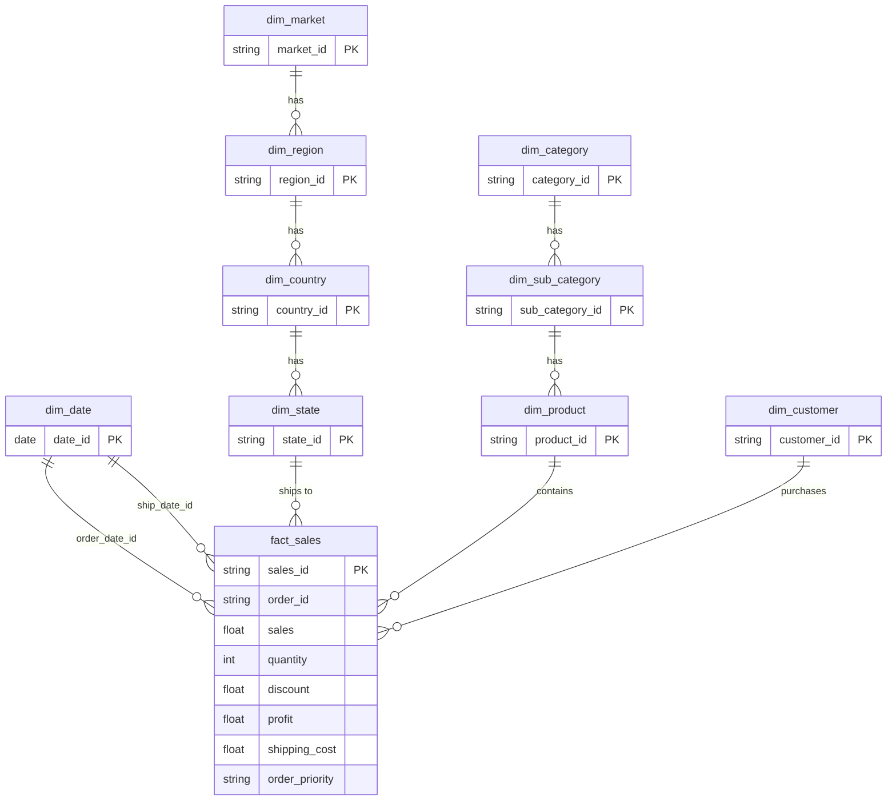

[](README.md)
&nbsp;&nbsp;
[](README.zh-CN.md)

# Superstore 銷售與利潤分析

**MySQL · Python · Power BI · 資料倉儲**

---

## 專案概述

本專案分析 [Kaggle Superstore Sales Dataset](https://www.kaggle.com/datasets/laibaanwer/superstore-sales-dataset)，以挖掘產品表現、獲利驅動因素，以及折扣策略對 7 個全球市場（2011–2014）的影響。

本專案的目標是透過結構化資料建模與視覺化分析，支援**採購決策、庫存規劃與促銷優化**。

### 本專案涵蓋內容

- 使用 **Python（pandas）** 進行資料清理與驗證
- 使用 **MySQL** 建立 Snowflake-style 維度模型（staging → dimensions/facts → views）  
  `vw_sales_full` 用於 row-level SQL / Python 分析；`vw_sales_summary` 用於預先彙總的 KPI 查詢
- 雙向資料核對（bidirectional reconciliation）以驗證資料流程完整性
- 使用 **Power BI** 製作 3 頁互動式儀表板
- 商業洞察與可執行建議

---

## 資料集

| 項目 | 說明 |
|---|---|
| 來源 | [Kaggle — Superstore Sales Dataset](https://www.kaggle.com/datasets/laibaanwer/superstore-sales-dataset) by Laiba Anwer |
| 筆數 | 約 51,000+ |
| 時間範圍 | 2011–2014 |
| 涵蓋範圍 | 7 個全球市場（APAC、EU、US、LATAM、EMEA、Africa、Canada） |
| 主要欄位 | Order Date、Ship Date、Customer、Segment、Region、Category、Sub-Category、Sales、Quantity、Discount、Profit、Shipping Cost、Order Priority |

---

## 工具與技術

| 工具 | 用途 |
|---|---|
| Python (pandas) | 資料清理、驗證、稽核報表 |
| MySQL | 維度建模、資料載入、分析 SQL |
| Power BI | 互動式儀表板與 KPI 視覺化 |
| GitHub | 版本控制與文件管理 |

---

## 1. 資料清理（Python）

### `01_raw_data_preview_cnt.py` — 原始資料稽核
- 產出完整稽核報表（Excel）：描述統計、缺失值、唯一值數量、資料型別
- 匯出前 100 筆資料預覽與 100 筆隨機樣本為 CSV

### `02_clean_data_cnt.py` — 資料清理與驗證
- **日期格式處理**：將不一致格式（DD/MM/YYYY、DD-MM-YYYY）轉為標準 datetime
- **數值驗證**：移除貨幣符號與千分位逗號，轉為數值，並將錯誤記錄輸出為 CSV
- **文字標準化**：移除重音符號（São Paulo → Sao Paulo）、清除前後空白、轉為 Proper Case
- **資料品質檢查**：分析小數精度；檢查 product ID ↔ product name 衝突
- **缺失值處理**：刪除 `order_date` 為空的列；將 `discount` 與 `shipping_cost` 的空值補為 0

### `03_clean_check_cnt.py` — 清理後驗證
- 重新執行完整稽核，以確認所有資料問題已修正

---

## 2. 資料庫設計（MySQL — Snowflake Schema）

本專案並非採用單一平面表，而是建立完整的 **Snowflake Schema**，以正規化的維度階層搭配中央事實表。

### Schema 圖



### 維度表

| 資料表 | 說明 | 設計重點 |
|---|---|---|
| `dim_date` | 10 年日曆表（2011–2020） | 預先產生 year、quarter、month、day_of_week、is_weekend |
| `dim_customer` | 唯一 customer + segment | 採用複合唯一鍵（customer_name, segment） |
| `dim_market` → `dim_region` → `dim_country` → `dim_state` | 地理階層 | 正規化 4 層地理層級並建立 foreign keys |
| `dim_category` → `dim_sub_category` → `dim_product` | 產品階層 | 透過複合鍵處理 product_id ↔ product_name 的 1:N 衝突 |
| `fact_sales` | 交易層級事實表 | 使用 surrogate key（sales_id）；保留重複的商業交易紀錄 |

---

## 3. SQL 流程與資料品質

### 載入與轉換

| 步驟 | 腳本 | 用途 |
|---|---|---|
| 1 | `01.create_import_staging_cnt.sql` | 建立 staging table 並載入清理後 CSV |
| 2 | `02.check_staging_data_cnt.sql` | 驗證列數、欄位數、唯一鍵與重複值 |
| 3 | `03.create_import_dim_fact_cnt.sql` | 建立所有維度表與事實表，並執行 multi-table INSERT |

### 雙向核對

| 步驟 | 腳本 | 用途 |
|---|---|---|
| 4 | `04.check_staging_exists_fact_not.sql` | staging 存在但 fact 缺失的資料（載入缺口） |
| 5 | `05.check_fact_exists_staging_not.sql` | fact 存在但 staging 缺失的資料（異常資料） |
| 6 | `08.staging_vs_fact_view.sql` | 比較各層資料總量（rows、sales、quantity、profit） |

### Views 與 Indexes

| 步驟 | 腳本 | 用途 |
|---|---|---|
| 7 | `06.create_view.sql` | `vw_sales_full` — 展平後的 row-level view，供 SQL ad-hoc 分析與 Python EDA 使用 |
| 8 | `09.index.sql` | `vw_sales_summary` — 依時間 / segment / region / category 預先彙總的 view，用於 KPI 查詢；並建立 `fact_sales` 索引 |
| 9 | `07.check_fact_vw_distinct.sql` | 驗證 fact table 與 view 的 distinct value 數量一致性 |

---

## 4. SQL 分析

### 分析查詢檔案（`sql/analyst/`）

| 檔案 | 資料來源 View | 說明 |
|---|---|---|
| `product_sales_by_month.sql` | `vw_sales_full` | 依產品 × 年月彙總 sales、quantity、discount、profit |
| `product_sales_by_year.sql` | `vw_sales_full` | 依產品 × 年份彙總 sales、quantity、profit |
| `product_profit_summary.sql` | `vw_sales_full` | 依產品彙總 sales、quantity、profit、shipping cost（全期間） |
| `geo_sales_by_category.sql` | `vw_sales_full` | 依 market / country / state × category / sub-category 彙總銷售與利潤 |
| `category_profit_summary.sql` | `vw_sales_summary` | 類別層級的 sales、profit 與加權 margin 分析 |
| `discount_band_profitability.sql` | `vw_sales_full` | 折扣區間（無 / 低 / 中 / 高）對 sales 與 profit margin 的影響 |

### 主要商業問題

**哪些類別帶來最高的銷售與利潤？**
```sql
-- category_profit_summary.sql
SELECT
    category_name,
    ROUND(SUM(total_sales), 0)  AS sales,
    ROUND(SUM(total_profit), 0) AS profit,
    ROUND(
        SUM(total_profit) / NULLIF(SUM(total_sales), 0) * 100
    , 1)                         AS margin_pct
FROM vw_sales_summary
GROUP BY category_name
ORDER BY sales DESC;
```

**折扣如何影響獲利能力？**
```sql
-- discount_band_profitability.sql
SELECT
    CASE
        WHEN discount = 0        THEN 'No Discount'
        WHEN discount <= 0.10    THEN 'Low (0–10%)'
        WHEN discount <= 0.30    THEN 'Medium (11–30%)'
        ELSE                          'High (>30%)'
    END AS discount_band,
    SUM(sales)   AS total_sales,
    SUM(profit)  AS total_profit,
    ROUND(SUM(profit) / NULLIF(SUM(sales), 0) * 100, 2) AS profit_margin_pct
FROM vw_sales_full
GROUP BY discount_band
ORDER BY profit_margin_pct DESC;
```

---

## 5. Power BI 儀表板（3 頁）

### 第 1 頁：Executive Summary


- **KPI Cards**：Sales ($4.30M)、Profit ($504K)、ROI (13.28%)、Sales YoY (+26.25%)、Avg Margin (11.72%)
- **Sales Trend**：2013 vs 2014 月度比較，觀察季節性模式
- **Top 10 Sub-Categories**：銷售、利潤、margin 排名表，負 margin 以條件格式標示
- **Market Distribution**：圓餅圖 — APAC (28%)、EU (24%)、US (17%)、LATAM (16%)、EMEA (7%)
- **ABC Analysis**：依銷售與利潤貢獻做 sub-category 分級
- **Slicers**：Segment、Category

### 第 2 頁：Product Performance


- 類別獲利能力比較（Technology 14%、Office Supplies 14%、Furniture 7%）
- Sub-category 2011–2014 年度 sales 與 profit 長條圖
- ABC Treemap 視覺化 sub-category 分級
- Segment 與 Category 的銷售分布圓餅圖

### 第 3 頁：Promotion Impact


- **Scatter Plot**：Sub-category 的平均折扣率 vs 平均 margin（泡泡大小 = quantity）
- **Discount Impact Charts**：不同折扣層級在各年份的 sales 與 profit 分布
- **ROI by Sub-Category**：由 Paper（最高）到 Tables（負 ROI）的排名
- 年度 profit 趨勢

---

## 關鍵洞察

### KPI 摘要（2014）

| KPI | 實際值 | 相對目標 |
|---|---|---|
| Total Sales | $4.30M | 高於目標 14.78% |
| Total Profit | $504K | 高於目標 12.20% |
| ROI | 13.28% | 高於目標（10%）32.28% |
| Sales YoY Growth | +26.25% | 較 2013 增加 $894K |
| Avg Margin | 11.72% | 所有交易的加權平均 |

### 類別表現

| Category | Sales | Profit Margin | 評估 |
|---|---|---|---|
| Technology | $4.74M | 13.99% | 核心成長引擎，銷售與利潤率皆最高 |
| Office Supplies | $3.79M | 13.69% | 穩定的利潤來源 |
| Furniture | $4.11M | 6.98% | 高營收但利潤率明顯偏低，需檢討成本 |

- **Segment**：Consumer 貢獻 51.48% 總銷售；Home Office 擁有最高 margin（11.99%）
- **銷售額最高的 sub-categories**：Phones ($552K)、Copiers ($550K)、Bookcases ($513K)
- **利潤率最高的 sub-categories**：Copiers (18.9%)、Accessories (16.4%)、Appliances (14.7%)
- **警訊**：Tables 的 margin 為 -12.55%，淨虧損 -$30K

### ABC 分類（依銷售貢獻）

| 類別 | Sub-categories | 說明 |
|---|---|---|
| A（前 70%） | Phones、Copiers、Chairs、Bookcases、Storage、Appliances | 核心營收來源 |
| B（接續 20%） | Machines、Tables、Accessories、Binders | Tables 是唯一連續 4 年虧損的項目 |
| C（最後 10%） | Furnishings、Art、Paper、Supplies、Envelopes、Fasteners、Labels | 體量較小，持續監控即可 |

### 折扣影響

| Discount Band | Profit Margin | 評估 |
|---|---|---|
| No Discount | 25.32% | 最健康，顯示需求強且無需額外促銷 |
| Low (0–10%) | 16.56% | 銷量與利潤的最佳平衡 |
| Medium (11–30%) | 7.11% | 利潤偏薄，需審慎使用 |
| High (>30%) | **-40.65%** | 落入淨虧損區間，應避免 |

---

## 商業建議

1. **將折扣上限控制在 10%** — 超過 30% 的折扣平均 margin 為 -40.65%。對於 Copiers 這類高表現品項，10% 折扣帶來的銷量比 20% 折扣高出 75%，顯示更深折扣並無必要。

2. **優先檢討 Tables** — Tables 連續 4 年維持負利潤（margin -12.55%、ROI -11.15%）。2014 年雖然 sales 年增 20%，但淨虧損卻擴大至前一年的 200%。建議暫停 20% 以上促銷，並先檢討成本結構。

3. **重新檢視 Furniture 成本結構** — Furniture 是第二高營收類別（$4.11M），但 margin 僅 6.98%，遠低於 Technology 的 13.99%。其中 Chairs（9.45%）與 Storage（9.62%）雖屬 A 類銷售主力，margin 表現仍偏弱。

4. **加碼 Technology 與 Copiers** — Technology 同時擁有最高營收占比（37.53%）與最高 margin（13.99%）。其中 Copiers 的 ROI 達 23%，明顯高於 10% 目標，是最具價值的 sub-category。

5. **重新設定 Machines 的折扣上限** — Machines 的 ROI 為 7.71%，低於 10% 目標，主因是 50% 折扣交易過多，導致負利潤。可參考 2012 年表現（ROI 10.66%）回推較合理的折扣上限，預估可恢復約 3% margin。

6. **關注 A 類中表現偏弱的品項** — Chairs 在 2014 年 ROI 為 9.12%，低於 10% 目標，主要受到 25–27% 折扣交易增加影響。建議限制 Chairs 超過 20% 的促銷，以防利潤持續惡化。

7. **以 sub-category 為單位制定折扣策略，取代一刀切的折扣政策** — 每個 A 類 sub-category 都應根據其 margin curve 設定個別折扣上限，而非套用相同促銷比例。

---

## 專案結構

```text
01_Superstore_Sales_Analysis/
│
├── data/                                            # 原始資料集（CSV）
├── scripts/
│   ├── 01_raw_data_preview_cnt.py                   # 原始資料稽核
│   ├── 02_clean_data_cnt.py                         # 資料清理與驗證
│   └── 03_clean_audit_cnt.py                        # 清理後驗證
├── output/                                          # 流程產出的檔案（稽核報表、清理後 CSV）
├── sql/
│   ├── 01–08 pipeline scripts                       # Staging → dimensions → fact → views
│   ├── 09.index.sql                                 # 索引與 summary view
│   ├── analyst/                                     # 分析查詢
│   │   ├── product_sales_by_month.sql               # Product × year-month
│   │   ├── product_sales_by_year.sql                # Product × year
│   │   ├── product_profit_summary.sql               # Product 全期間利潤摘要
│   │   ├── geo_sales_by_category.sql                # Market / country / state × category
│   │   ├── category_profit_summary.sql              # Category 銷售、利潤與 margin
│   │   └── discount_band_profitability.sql          # 折扣區間對利潤的影響
│   └── utils/                                       # 工具腳本（drop_table.sql、test_powerbi.sql）
├── powerBI/
│   ├── superstore.pbix                              # Power BI 儀表板
│   └── superstore.pdf                               # 儀表板匯出（3 頁）
├── screenshot/                                      # 儀表板截圖
└── README.md
```

---

## 如何重現

**前置需求**：Python 3.8+、MySQL 8.0+、Power BI Desktop

1. 從 [Kaggle](https://www.kaggle.com/datasets/laibaanwer/superstore-sales-dataset) 下載 `superstore.csv`
2. 執行 `python scripts/01_raw_data_preview_cnt.py` 產出原始資料稽核報表
3. 執行 `python scripts/02_clean_data_cnt.py` 進行資料清理與驗證
4. 依序在 MySQL 執行 SQL 腳本（`01` → `08`）
5. 使用 Power BI Desktop 開啟 `superstore.pbix` 並連接到你的 MySQL instance  
   直接匯入以下資料表（Star Schema）：  
   - **Fact**：`fact_sales`  
   - **Dimensions**：`dim_date`（需標記為 Date Table）、`dim_customer`、`dim_product`、`dim_sub_category`、`dim_category`、`dim_state`、`dim_country`、`dim_region`、`dim_market`  
   - **Note**：`vw_sales_full` 用於 SQL / Python ad-hoc 分析；`vw_sales_summary` 用於 MySQL KPI 查詢。兩者皆不是 Power BI 的資料來源。

---

## 作者

Ross Tang | [GitHub](https://github.com/ross-bi)

## 授權

本專案採用 MIT License 授權。詳情請參閱 [LICENSE](./LICENSE) 檔案。
