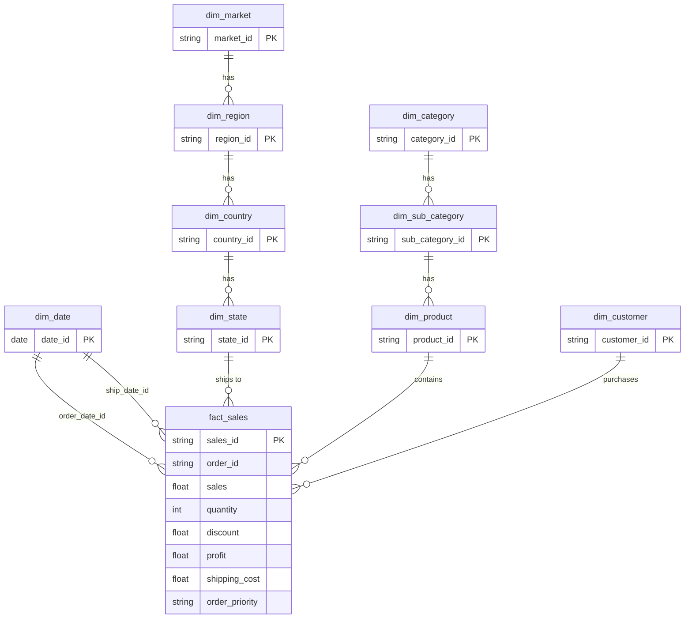

[](README.md)
&nbsp;&nbsp;
[](README.zh-CN.md)

# Superstore 銷售與利潤分析

**MySQL · Python · Power BI · 資料倉儲**

---

## 專案概述

本專案分析 [Kaggle Superstore Sales Dataset](https://www.kaggle.com/datasets/laibaanwer/superstore-sales-dataset)，以挖掘產品表現、獲利驅動因素，以及折扣策略對 7 個全球市場（2011–2014）的影響。

本專案的目標是透過結構化資料建模與視覺化分析，支援**採購決策、庫存規劃與促銷優化**。

### 本專案涵蓋內容

- 使用 **Python（pandas）** 進行資料清理與驗證
- 使用 **MySQL** 建立 Snowflake-style 維度模型（staging → dimensions/facts → views）  
  `vw_sales_full` 用於 row-level SQL / Python 分析；`vw_sales_summary` 用於預先彙總的 KPI 查詢
- 雙向資料核對（bidirectional reconciliation）以驗證資料流程完整性
- 使用 **Power BI** 製作 3 頁互動式儀表板
- 商業洞察與可執行建議

---

## 資料集

| 項目 | 說明 |
|---|---|
| 來源 | [Kaggle — Superstore Sales Dataset](https://www.kaggle.com/datasets/laibaanwer/superstore-sales-dataset) by Laiba Anwer |
| 筆數 | 約 51,000+ |
| 時間範圍 | 2011–2014 |
| 涵蓋範圍 | 7 個全球市場（APAC、EU、US、LATAM、EMEA、Africa、Canada） |
| 主要欄位 | Order Date、Ship Date、Customer、Segment、Region、Category、Sub-Category、Sales、Quantity、Discount、Profit、Shipping Cost、Order Priority |

---

## 工具與技術

| 工具 | 用途 |
|---|---|
| Python (pandas) | 資料清理、驗證、稽核報表 |
| MySQL | 維度建模、資料載入、分析 SQL |
| Power BI | 互動式儀表板與 KPI 視覺化 |
| GitHub | 版本控制與文件管理 |

---

## 1. 資料清理（Python）

### `01_raw_data_preview_cnt.py` — 原始資料稽核
- 產出完整稽核報表（Excel）：描述統計、缺失值、唯一值數量、資料型別
- 匯出前 100 筆資料預覽與 100 筆隨機樣本為 CSV

### `02_clean_data_cnt.py` — 資料清理與驗證
- **日期格式處理**：將不一致格式（DD/MM/YYYY、DD-MM-YYYY）轉為標準 datetime
- **數值驗證**：移除貨幣符號與千分位逗號，轉為數值，並將錯誤記錄輸出為 CSV
- **文字標準化**：移除重音符號（São Paulo → Sao Paulo）、清除前後空白、轉為 Proper Case
- **資料品質檢查**：分析小數精度；檢查 product ID ↔ product name 衝突
- **缺失值處理**：刪除 `order_date` 為空的列；將 `discount` 與 `shipping_cost` 的空值補為 0

### `03_clean_check_cnt.py` — 清理後驗證
- 重新執行完整稽核，以確認所有資料問題已修正

---

## 2. 資料庫設計（MySQL — Snowflake Schema）

本專案並非採用單一平面表，而是建立完整的 **Snowflake Schema**，以正規化的維度階層搭配中央事實表。

### Schema 圖



### 維度表

| 資料表 | 說明 | 設計重點 |
|---|---|---|
| `dim_date` | 10 年日曆表（2011–2020） | 預先產生 year、quarter、month、day_of_week、is_weekend |
| `dim_customer` | 唯一 customer + segment | 採用複合唯一鍵（customer_name, segment） |
| `dim_market` → `dim_region` → `dim_country` → `dim_state` | 地理階層 | 正規化 4 層地理層級並建立 foreign keys |
| `dim_category` → `dim_sub_category` → `dim_product` | 產品階層 | 透過複合鍵處理 product_id ↔ product_name 的 1:N 衝突 |
| `fact_sales` | 交易層級事實表 | 使用 surrogate key（sales_id）；保留重複的商業交易紀錄 |

---

## 3. SQL 流程與資料品質

### 載入與轉換

| 步驟 | 腳本 | 用途 |
|---|---|---|
| 1 | `01.create_import_staging_cnt.sql` | 建立 staging table 並載入清理後 CSV |
| 2 | `02.check_staging_data_cnt.sql` | 驗證列數、欄位數、唯一鍵與重複值 |
| 3 | `03.create_import_dim_fact_cnt.sql` | 建立所有維度表與事實表，並執行 multi-table INSERT |

### 雙向核對

| 步驟 | 腳本 | 用途 |
|---|---|---|
| 4 | `04.check_staging_exists_fact_not.sql` | staging 存在但 fact 缺失的資料（載入缺口） |
| 5 | `05.check_fact_exists_staging_not.sql` | fact 存在但 staging 缺失的資料（異常資料） |
| 6 | `08.staging_vs_fact_view.sql` | 比較各層資料總量（rows、sales、quantity、profit） |

### Views 與 Indexes

| 步驟 | 腳本 | 用途 |
|---|---|---|
| 7 | `06.create_view.sql` | `vw_sales_full` — 展平後的 row-level view，供 SQL ad-hoc 分析與 Python EDA 使用 |
| 8 | `09.index.sql` | `vw_sales_summary` — 依時間 / segment / region / category 預先彙總的 view，用於 KPI 查詢；並建立 `fact_sales` 索引 |
| 9 | `07.check_fact_vw_distinct.sql` | 驗證 fact table 與 view 的 distinct value 數量一致性 |

---

## 4. SQL 分析

### 分析查詢檔案（`sql/analyst/`）

| 檔案 | 資料來源 View | 說明 |
|---|---|---|
| `product_sales_by_month.sql` | `vw_sales_full` | 依產品 × 年月彙總 sales、quantity、discount、profit |
| `product_sales_by_year.sql` | `vw_sales_full` | 依產品 × 年份彙總 sales、quantity、profit |
| `product_profit_summary.sql` | `vw_sales_full` | 依產品彙總 sales、quantity、profit、shipping cost（全期間） |
| `geo_sales_by_category.sql` | `vw_sales_full` | 依 market / country / state × category / sub-category 彙總銷售與利潤 |
| `category_profit_summary.sql` | `vw_sales_summary` | 類別層級的 sales、profit 與加權 margin 分析 |
| `discount_band_profitability.sql` | `vw_sales_full` | 折扣區間（無 / 低 / 中 / 高）對 sales 與 profit margin 的影響 |

### 主要商業問題

**哪些類別帶來最高的銷售與利潤？**
```sql
-- category_profit_summary.sql
SELECT
    category_name,
    ROUND(SUM(total_sales), 0)  AS sales,
    ROUND(SUM(total_profit), 0) AS profit,
    ROUND(
        SUM(total_profit) / NULLIF(SUM(total_sales), 0) * 100
    , 1)                         AS margin_pct
FROM vw_sales_summary
GROUP BY category_name
ORDER BY sales DESC;
```

**折扣如何影響獲利能力？**
```sql
-- discount_band_profitability.sql
SELECT
    CASE
        WHEN discount = 0        THEN 'No Discount'
        WHEN discount <= 0.10    THEN 'Low (0–10%)'
        WHEN discount <= 0.30    THEN 'Medium (11–30%)'
        ELSE                          'High (>30%)'
    END AS discount_band,
    SUM(sales)   AS total_sales,
    SUM(profit)  AS total_profit,
    ROUND(SUM(profit) / NULLIF(SUM(sales), 0) * 100, 2) AS profit_margin_pct
FROM vw_sales_full
GROUP BY discount_band
ORDER BY profit_margin_pct DESC;
```

---

## 5. Power BI 儀表板（3 頁）

### 第 1 頁：Sales Overview


- 此頁作為管理層總覽頁，整合 KPI 卡、月度趨勢、類別貢獻與熱銷產品排名，用來快速回答「2014 年整體業績表現如何、成長來自哪裡、獲利品質是否同步改善」等核心問題 。2014 年總銷售額為 $4.30M、總利潤為 $504.17K、整體利潤率為 11.72%，銷售額與利潤年增率分別為 26.25% 與 23.41%，顯示公司在規模與獲利上皆有明顯成長 。

- 從類別表現來看，Technology 是最強的核心品類，2014 年銷售額達 $1.62M、利潤達 $234.93K，利潤率為 14.54%，在規模與獲利效率上都領先其他大類 。Office Supplies 也表現穩健，2014 年銷售額為 $1.31M，利潤率為 13.78%；相較之下，Furniture 雖然銷售額達 $1.38M，但利潤僅 $89.31K，利潤率只有 6.48%，明顯落後 。進一步拆解可發現，Furniture 的主要問題來自 Tables 子類別，雖然 2014 年銷售仍成長 20.31%，但全年虧損 $30.55K，利潤率為 -12.55%，屬於典型的「有成長但沒賺錢」子類別 。

- 產品層級顯示，2014 年的成長並不是平均分布在所有商品上，而是高度集中於少數明星產品。Canon Imageclass 2200 Advanced Copier 在 2014 年較 2013 年增加 $9.8K 銷售，並貢獻約 $15.68K 利潤，是兼具成長與獲利的代表產品 。Apple Smart Phone, Cordless、Sauder Classic Bookcase, Traditional 與 Hoover Stove, Red 也都帶來顯著增量，顯示部分高價值產品對年度成長貢獻非常集中 。但值得注意的是，並非所有高成長產品都健康，例如 Novimex Executive Leather Armchair, Red 雖然銷售年增 $7.07K，但 2014 年仍為負利潤，說明單看 sales growth 可能會高估實際商業價值.


### 第 2 頁：Market & Customer Performance


- 此頁聚焦市場與客群表現，透過地理銷售分布、Market 比較、Segment 分析與客戶排名，幫助管理層理解「業績來自哪些市場、哪些客群貢獻最大、哪些區域具備更高成長動能」 。這一頁的設計價值在於，它不只呈現大盤規模，也能支援由市場往下 drill-down 到國家、區域與客戶層級的分析 。

- 以 Market 來看，APAC 是 2014 年最大市場，銷售額達 $1.21M，維持公司最重要的收入來源地位 。但若看增量，EU 在 2014 年比 2013 年增加 $280.54K 銷售，是主要市場中絕對成長額最高者；而 EMEA 則是成長率最快的市場，銷售年增率為 47.42%，利潤年增率更高達 113.25%，雖然基期較小，但展現出非常強的擴張潛力 。US 仍是重要成熟市場，2014 年銷售額達 $734.02K；LATAM 則額外增加近 $98.54K 銷售，說明公司的成長來源相對分散，而非只依賴單一市場 。

- 客群層級方面，Consumer 仍是最大 Segment，2014 年銷售額為 $2.14M，維持業績主體 。但若看成長速度，Home Office 才是最具潛力的客群，2014 年銷售年增率為 41.45%，利潤年增率為 46.01%，成長表現明顯優於 Consumer 與 Corporate 。Corporate 雖然也有穩定增長，2014 年銷售年增率為 21.46%，但利潤年增僅 10.14%，反映該客群的獲利擴張速度相對保守 。整體而言，此頁能幫助管理層區分「目前最大市場」與「最值得投入的成長市場／客群」之間的差異 。


### 第 3 頁：Discount & Profitability


- 此頁聚焦折扣策略與獲利風險，目的是回答「折扣是否真的帶來健康成長、哪些產品在高折扣下變成虧損、哪些類別是利潤風險來源」 。這一頁也是整份 dashboard 最具商業洞察價值的部分，因為它把表面上的 sales growth 與實際的 margin quality 分開看待 。

- 高折扣產品分析顯示，多數嚴重虧損產品集中在 Furniture Tables，也延伸至部分 Chairs、Binders、Appliances、Machines 與 Copiers。像是 Hon Conference Table, Rectangular 的平均折扣為 80%，利潤率為 -184.95%；Barricks Conference Table, Rectangular 平均折扣 70%，利潤率為 -126.68%；Cubify Cubex 3D Printer Triple Head Print 雖然有 $8.0K 銷售，但在 50% 平均折扣下仍虧損約 $3.84K 。這些例子顯示高折扣不只是壓低利潤，而是可能直接把訂單推向嚴重虧損 。

- 進一步從成長與虧損交叉分析來看，部分產品在 2014 年雖然銷售成長非常快，但依然持續虧損。Breville Microwave, Silver 的銷售年增率達 293.63%，但 2014 年虧損約 $1.78K；Bevis Wood Table, With Bottom Storage 的銷售年增率達 600.13%，但 2014 年仍虧損約 $1.64K 。這代表某些業績成長其實是透過折價換來，並沒有帶動實際的商業價值 。從類別結構看，Furniture Tables 最值得被列為獲利風險警示，因其 2014 年銷售由 $202.36K 增至 $243.46K，但仍產生 -$30.55K 利潤與 -12.55% 利潤率，是拖累整體 Furniture 表現的關鍵原因 。


---

## 關鍵洞察
- 2014 年整體表現強勁，總銷售額達 $4.30M、總利潤達 $504.17K，銷售與利潤年增率分別為 26.25% 與 23.41%，顯示業務規模與獲利同步擴大 。

- Technology 是表現最強的核心類別，2014 年銷售額為 $1.62M、利潤為 $234.93K、利潤率為 14.54%，在規模與效益兩方面都明顯領先 。

- Furniture 是三大類中利潤率最低的類別，2014 年雖有 $1.38M 銷售，但利潤率僅 6.48%，反映其成長品質不如其他類別 。

- Furniture 的主要問題集中在 Tables 子類別，該子類別 2014 年銷售年增 20.31%，卻仍虧損 $30.55K，利潤率為 -12.55%，屬於結構性虧損項目 。

- 產品成長高度集中於少數關鍵商品，其中 Canon Imageclass 2200 Advanced Copier 在 2014 年增加 $9.8K 銷售，並貢獻約 $15.68K 利潤，是最具代表性的成長引擎之一 。

- 並非所有高成長產品都具備高商業價值，例如 Novimex Executive Leather Armchair, Red 雖然銷售大幅增加，但 2014 年仍為負利潤，反映成長不一定等於健康 。

- APAC 是 2014 年最大市場，銷售額達 $1.21M；EU 則帶來最高的絕對成長額，新增 $280.54K 銷售，而 EMEA 則以 47.42% 銷售年增率與 113.25% 利潤年增率成為最快速成長市場 。

- Consumer 是最大客群，2014 年銷售額達 $2.14M；但 Home Office 才是最具成長性的 Segment，銷售與利潤年增率分別達 41.45% 與 46.01% 。

- 高折扣與虧損高度相關，尤其集中在 Furniture Tables、Appliances、Binders 與 Machines，多個產品在高折扣條件下呈現明顯負利潤率 。

- 部分產品同時呈現「高成長、低獲利甚至虧損」特徵，代表單看營收或 YoY 成長率，可能會誤判業務健康度 。

---

## 商業建議

- 優先投資 Technology 與部分高效益的 Office Supplies 子類別，因為它們兼具營收規模與較健康的獲利率，比 Furniture 更適合作為未來成長主軸 。

- 對 Furniture 採取子類別層級管理，而非只看整體類別表現，因為 Bookcases 與 Furnishings 仍有利潤，但 Tables 已呈現結構性虧損 。

- 立即收緊高風險子類別的折扣治理，尤其是 Tables、Binders、Appliances 與 Machines，因為這些類別中多次出現高折扣導致深度虧損的交易模式 。

- 建立產品層級的折扣上限與毛利門檻，避免用價格換取表面上的營收成長，卻犧牲實際利潤 。

- 將高成長但持續虧損的產品列入商業檢討清單，因為這些商品會製造「營收看起來漂亮、實際獲利惡化」的假象 。

- 在維持 APAC 作為主要收入基地的同時，應加強關注 EU 與 EMEA 等高成長市場，評估是否值得投入更多商業資源擴張 。

- 提高對 Home Office 客群的經營優先順序，因其在 2014 年展現出最強的銷售與利潤成長動能 。

- 將未來績效管理從單純追求銷售額，轉向同時追蹤子類別利潤率、折扣風險與產品層級獲利品質，以提升決策準確度 。


---

## 專案結構

```text
01_Superstore_Sales_Analysis/
│
├── data/                                            # 原始資料集（CSV）
├── scripts/
│   ├── 01_raw_data_preview_cnt.py                   # 原始資料稽核
│   ├── 02_clean_data_cnt.py                         # 資料清理與驗證
│   └── 03_clean_audit_cnt.py                        # 清理後驗證
├── output/                                          # 流程產出的檔案（稽核報表、清理後 CSV）
├── sql/
│   ├── 01–08 pipeline scripts                       # Staging → dimensions → fact → views
│   ├── 09.index.sql                                 # 索引與 summary view
│   ├── analyst/                                     # 分析查詢
│   │   ├── product_sales_by_month.sql               # Product × year-month
│   │   ├── product_sales_by_year.sql                # Product × year
│   │   ├── product_profit_summary.sql               # Product 全期間利潤摘要
│   │   ├── geo_sales_by_category.sql                # Market / country / state × category
│   │   ├── category_profit_summary.sql              # Category 銷售、利潤與 margin
│   │   └── discount_band_profitability.sql          # 折扣區間對利潤的影響
│   └── utils/                                       # 工具腳本（drop_table.sql、test_powerbi.sql）
├── powerBI/
│   ├── superstore.pbix                              # Power BI 儀表板
│   └── superstore.pdf                               # 儀表板匯出（3 頁）
├── screenshot/                                      # 儀表板截圖
└── README.md
```

---

## 如何重現

**前置需求**：Python 3.8+、MySQL 8.0+、Power BI Desktop

1. 從 [Kaggle](https://www.kaggle.com/datasets/laibaanwer/superstore-sales-dataset) 下載 `superstore.csv`
2. 執行 `python scripts/01_raw_data_preview_cnt.py` 產出原始資料稽核報表
3. 執行 `python scripts/02_clean_data_cnt.py` 進行資料清理與驗證
4. 依序在 MySQL 執行 SQL 腳本（`01` → `08`）
5. 使用 Power BI Desktop 開啟 `superstore.pbix` 並連接到你的 MySQL instance  
   直接匯入以下資料表（Star Schema）：  
   - **Fact**：`fact_sales`  
   - **Dimensions**：`dim_date`（需標記為 Date Table）、`dim_customer`、`dim_product`、`dim_sub_category`、`dim_category`、`dim_state`、`dim_country`、`dim_region`、`dim_market`  
   - **Note**：`vw_sales_full` 用於 SQL / Python ad-hoc 分析；`vw_sales_summary` 用於 MySQL KPI 查詢。兩者皆不是 Power BI 的資料來源。

---

## 作者

Ross Tang | [GitHub](https://github.com/ross-bi)

## 授權

本專案採用 MIT License 授權。詳情請參閱 [LICENSE](./LICENSE) 檔案。
