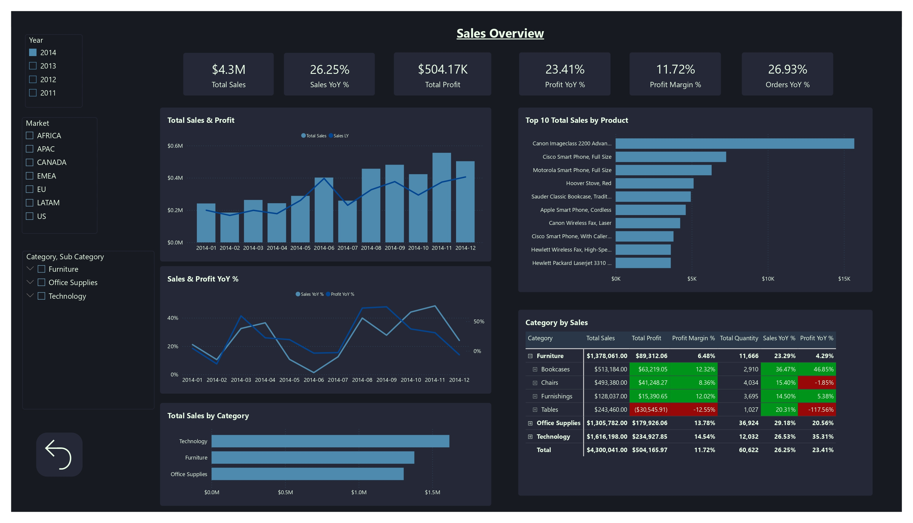
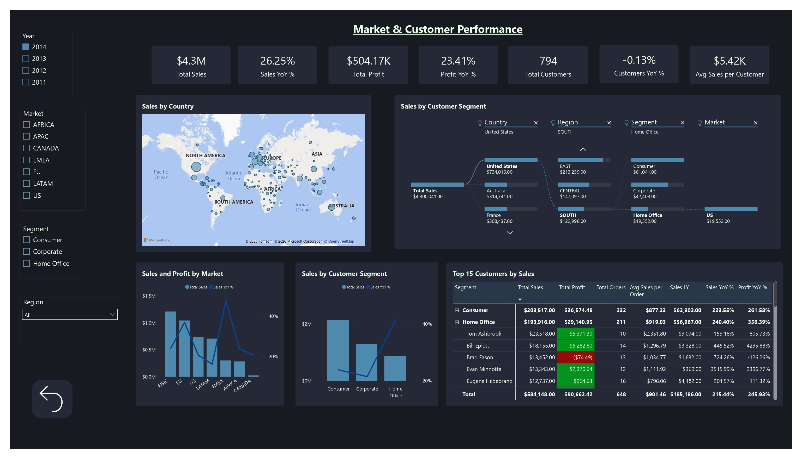
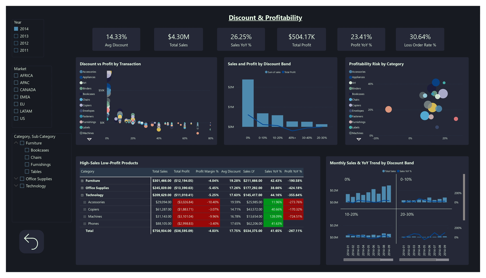

[](README.md)
&nbsp;&nbsp;
[](README.zh-CN.md)


# 超市銷售與利潤分析

**MySQL · Python · Power BI · Data Warehouse**

---

## 專案概述

本專案分析 [Kaggle Superstore 銷售資料集](https://www.kaggle.com/datasets/laibaanwer/superstore-sales-dataset)，深入探討 2011–2014 年間全球 7 個市場的產品表現、獲利驅動因素及折扣策略影響。

目標是透過結構化資料建模與視覺化分析，支援**採購決策、庫存規劃與促銷優化**。

### 專案涵蓋範圍

- 使用 **Python (pandas)** 進行資料清洗與驗證
- 在 **MySQL** 中建立 Snowflake 式維度模型（staging → 維度/事實表 → 視圖）：  
  `vw_sales_full` 供行級 SQL/Python 分析；`vw_sales_summary` 供預先彙總的 KPI 查詢
- 雙向資料核對以驗證資料管道完整性
- 在 **Power BI** 中建立 3 頁互動式儀表板
- 業務洞察與可行建議

---

## 資料集

| 項目 | 詳細資訊 |
|---|---|
| 來源 | [Kaggle — Superstore Sales Dataset](https://www.kaggle.com/datasets/laibaanwer/superstore-sales-dataset)，作者：Laiba Anwer |
| 筆數 | ~51,000+ |
| 時間範圍 | 2011–2014 |
| 涵蓋範圍 | 全球 7 個市場（APAC、EU、US、LATAM、EMEA、Africa、Canada） |
| 主要欄位 | 訂單日期、出貨日期、客戶、客戶類別、地區、產品類別、子類別、銷售額、數量、折扣、利潤、運費、訂單優先級 |

---

## 工具與技術

| 工具 | 用途 |
|---|---|
| Python (pandas) | 資料清洗、驗證、稽核報告 |
| MySQL | 維度建模、資料載入、分析 SQL |
| Power BI | 互動式儀表板與 KPI 視覺化 |
| GitHub | 版本控制與文件管理 |

---

## 1. 資料清洗（Python）

### `01_raw_data_preview_cnt.py` — 原始資料稽核
- 生成完整稽核報告（Excel）：描述性統計、缺失值、唯一值計數、資料型別
- 匯出行預覽（100 筆）與隨機樣本（100 筆）為 CSV

### `02_clean_data_cnt.py` — 資料清洗與驗證
- **日期格式化**：將不一致格式（DD/MM/YYYY、DD-MM-YYYY）統一轉換為標準 datetime
- **數值驗證**：去除貨幣符號與逗號，強制轉換為數值型別，並將錯誤記錄至 CSV
- **文字標準化**：移除重音符號（São Paulo → Sao Paulo）、去除空白、統一首字母大寫
- **資料品質檢查**：小數精度分析；偵測 product ID ↔ product name 衝突
- **缺失值處理**：刪除 `order_date` 為空的列；以 0 填補缺失的 `discount` 與 `shipping_cost`

### `03_clean_check_cnt.py` — 清洗後驗證
- 對清洗後的資料重新執行完整稽核，確認所有問題已解決

---

## 2. 資料庫設計（MySQL — Snowflake Schema）

本專案不採用平面表格，而是實作完整的 **Snowflake Schema**，包含正規化的維度層級與中央事實表。

### Schema 圖


### 維度表

| 表格 | 說明 | 主要設計決策 |
|---|---|---|
| `dim_date` | 10 年日曆（2011–2020） | 預先生成，含 year、quarter、month、day_of_week、is_weekend |
| `dim_customer` | 唯一客戶 + 客戶類別 | 複合唯一鍵（customer_name, segment） |
| `dim_region` → `dim_market` → `dim_country` → `dim_state` | 地理層級 | 正規化 4 層層級，使用外鍵關聯 |
| `dim_category` → `dim_sub_category` → `dim_product` | 產品層級 | 透過複合鍵處理 product_id ↔ product_name 的 1:N 衝突 |
| `fact_sales` | 交易級事實資料 | 代理鍵（sales_id）；保留重複的業務記錄 |

---

## 3. SQL 管道與資料品質

### 載入與轉換

| 步驟 | 腳本 | 用途 |
|---|---|---|
| 1 | `01.create_import_staging_cnt.sql` | 建立 staging 表並載入已清洗的 CSV |
| 2 | `02.check_staging_data_cnt.sql` | 驗證列數/欄數、唯一鍵、重複值 |
| 3 | `03.create_import_dim_fact_cnt.sql` | 透過多表 INSERT 建立所有維度表與事實表 |

### 雙向核對

| 步驟 | 腳本 | 用途 |
|---|---|---|
| 4 | `04.check_staging_exists_fact_not.sql` | staging 有但 fact 缺少的記錄（載入遺漏） |
| 5 | `05.check_fact_exists_staging_not.sql` | fact 有但 staging 缺少的記錄（幽靈記錄） |
| 6 | `08.staging_vs_fact_view.sql` | 比較所有層級的總計（列數、銷售額、數量、利潤） |

### 視圖與索引

| 步驟 | 腳本 | 用途 |
|---|---|---|
| 7 | `06.create_view.sql` | `vw_sales_full` — 行級 flattened 視圖，供 SQL ad-hoc 分析與 Python EDA 使用 |
| 8 | `09.index.sql` | `vw_sales_summary` — 按時間/客戶類別/地區/產品類別預先彙總的 KPI 查詢視圖；建立 `fact_sales` 索引 |
| 9 | `07.check_fact_vw_distinct.sql` | 驗證事實表與視圖的唯一值計數 |

---

## 4. SQL 分析

### 主要業務問題

**哪些產品類別的銷售額與利潤最高？**
```sql
SELECT category_name,
       ROUND(SUM(total_sales), 0)  AS sales,
       ROUND(SUM(total_profit), 0) AS profit,
       ROUND(AVG(profit_margin_pct), 1) AS avg_margin_pct
FROM vw_sales_summary
GROUP BY category_name
ORDER BY sales DESC;
```

**折扣對獲利能力有何影響？**
```sql
SELECT
    CASE
        WHEN discount = 0        THEN '無折扣'
        WHEN discount <= 0.10    THEN '低折扣（0–10%）'
        WHEN discount <= 0.30    THEN '中折扣（11–30%）'
        ELSE                          '高折扣（>30%）'
    END AS discount_band,
    SUM(sales)   AS total_sales,
    SUM(profit)  AS total_profit,
    ROUND(SUM(profit) / NULLIF(SUM(sales), 0) * 100, 2) AS profit_margin_pct
FROM vw_sales_full
GROUP BY discount_band
ORDER BY profit_margin_pct DESC;
```

---

## 5. Power BI 儀表板（3 頁）

### 第 1 頁：高層摘要


- **KPI 卡片**：銷售額（$4.30M）、利潤（$504K）、ROI（13.28%）、銷售額 YoY（+26.25%）、平均利潤率（5.00%）
- **銷售趨勢**：月度對比（2013 vs 2014），突顯季節性規律
- **前 10 子類別**：銷售額、利潤、利潤率表格，含條件格式（負利潤率標紅）
- **市場分佈**：圓餅圖 — APAC（28%）、EU（24%）、US（17%）、LATAM（16%）、EMEA（7%）
- **ABC 分析**：按銷售額與利潤貢獻度分類子類別
- **篩選器**：客戶類別、產品類別

### 第 2 頁：產品表現


- 產品類別獲利比較（Technology 14%、Office Supplies 14%、Furniture 7%）
- 子類別年度銷售額與利潤長條圖（2011–2014）
- ABC 樹狀圖，視覺化子類別分類
- 客戶類別與產品類別銷售分佈圓餅圖

### 第 3 頁：促銷影響


- **散點圖**：各子類別平均折扣率 vs 平均利潤率（氣泡大小 = 數量）
- **折扣影響圖表**：各年度不同折扣級別的銷售額與利潤分佈
- **子類別 ROI 排名**：從 Paper（最高）到 Tables（負 ROI）
- 利潤年度趨勢

---

## 主要洞察

### 類別表現

| 類別 | 銷售額 | 利潤率 | 評估 |
|---|---|---|---|
| Technology | $4.74M | 14% | 核心成長引擎 — 銷售額與利潤率最高 |
| Office Supplies | $3.79M | 14% | 穩定獲利來源 |
| Furniture | $4.11M | 7% | 高銷量低利潤 — 需檢討定價策略 |

### 折扣影響

| 折扣級別 | 利潤率 | 評估 |
|---|---|---|
| 無折扣 | 25.32% | 最健康 — 無需優惠即有強勁需求 |
| 低折扣（0–10%） | 16.56% | 銷量與利潤的最佳平衡點 |
| 中折扣（11–30%） | 7.11% | 利潤薄 — 謹慎使用 |
| 高折扣（>30%） | **-40.65%** | 淨虧損 — 應避免 |

---

## 業務建議

1. **折扣上限設為 10%** — 超過 30% 的折扣持續產生淨虧損
2. **檢討 Furniture 成本結構** — 銷售額第 2 高，但利潤率僅 7%
3. **停售或重新定價 Tables** — 4 年來持續負利潤率（-13%）
4. **加大 Technology 投入** — 銷售額與利潤率的最強組合
5. **以產品類別差異化定價策略取代全面折扣**

---

## 專案結構
```
01_Superstore_Sales_Analysis/
│
├── data/ # 原始資料集（CSV）
├── scripts/
│ ├── 01_raw_data_preview_cnt.py # 原始資料稽核
│ ├── 02_clean_data_cnt.py # 資料清洗與驗證
│ └── 03_clean_audit_cnt.py # 清洗後驗證
├── output/ # 腳本生成的輸出檔案
│ ├── 01–04 管道腳本 # 原始稽核預覽 → 清洗預覽 → 清洗後匯入 → 清洗後稽核
├── sql/
│ ├── 01–08 管道腳本 # Staging → 維度表 → 事實表 → 視圖
│ ├── 09.index.sql # 索引與彙總視圖
│ └── analyst/ # 分析查詢
├── powerBI/
│ ├── superstore.pbix # Power BI 儀表板
│ └── superstore.pdf # 儀表板匯出（3 頁）
├── screenshot/ # 儀表板截圖
└── README.md
```

---

## 重現步驟

**前置條件**：Python 3.8+、MySQL 8.0+、Power BI Desktop

1. 從 [Kaggle](https://www.kaggle.com/datasets/laibaanwer/superstore-sales-dataset) 下載 `superstore.csv`
2. 執行 `python scripts/02_clean_data_cnt.py`
3. 依序在 MySQL 執行 SQL 腳本（`01` → `08`）
4. 在 Power BI Desktop 開啟 `superstore.pbix` 並連接至你的 MySQL 資料庫。  
   直接匯入以下資料表（Star Schema）：  
   - **事實表**：`fact_sales`  
   - **維度表**：`dim_date` *（設定為 Date Table）*、`dim_customer`、`dim_product`、`dim_sub_category`、`dim_category`、`dim_state`、`dim_country`、`dim_market`、`dim_region`  
   - **注意**：`vw_sales_full` 供 SQL/Python ad-hoc 分析使用；`vw_sales_summary` 供 MySQL KPI 查詢使用。兩者均不作為 Power BI 資料來源。

---

## 作者

Ross Tang | [GitHub](https://github.com/ross-bi)

## 授權

本專案採用 MIT 授權條款。詳情請參閱 [LICENSE](./LICENSE) 文件。